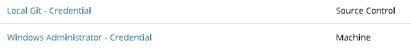
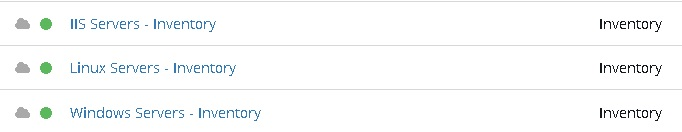
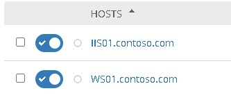
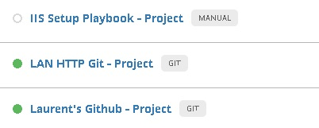
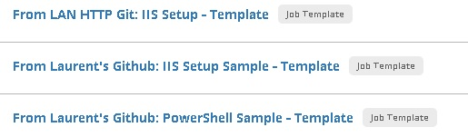

# AutomatedLab and Red Hat Ansible Automation Platform
[AutomatedLab](https://automatedlab.org) ([GitHub](https://github.com/AutomatedLab/AutomatedLab)) is a project that allows to set up lab and test environments on **Hyper-V** or **[Azure](https://portal.azure.com/)** with multiple products

Table of content:
- [AutomatedLab and Red Hat Ansible Automation Platform](#automatedlab-and-red-hat-ansible-automation-platform)
  - [Prerequisites](#prerequisites)
  - [Setup](#setup)
  - [Server Details](#server-details)
  - [Ansible Automation Platform Details](#ansible-automation-platform-details)
    - [Credentials](#credentials)
    - [Inventories](#inventories)
    - [Server Groups](#server-groups)
    - [Projects](#projects)
    - [Job Templates](#job-templates)

## Prerequisites 

  * An [AutomatedLab](https://automatedlab.org) environment 
  * A trial subscription for Ansible Automation Platform: https://www.redhat.com/en/technologies/management/ansible/trial

## Setup

Run the [Ansible Tower.ps1](./AutomatedLab/AutomatedLab%20-%20Ansible%20Tower.ps1) script (PowerShell 5.1 needed) and enter your credentials for your  trial subscription for Ansible Automation Platform when needed and wait for completion (~2 hours).
After completion you'll have:
* a Domain Controller: DC01
* a local Git server ([IIS](https://www.iis.net) is used as hosting platform): GIT01
* an IIS server for testing purpose: IIS01
* a Windows Server for testing purpose: WS01
* a Red Hat Enterprise Linux 8.6 (for hosting [Ansible Automation Platform](https://www.redhat.com/en/technologies/management/ansible/trial)): RHEL01

All Windows Servers are running 'Windows Server 2022 Datacenter (Desktop Experience)', credentials will be displayed a the end of the deployment process and a browser Windows will open to https://rhel01 (use Use admin/P@ssw0rd as credential).

## Server Details
* DC01: Domain Controller for the contoso.com domain
* GIT01: This local Git Server will host the content of the [IISSetup](./AutomatedLab/IISSetup/) folder as a git repository. The PowerShell script(s) inside this folder allow(s) you to install an IIS server with some **best practices**
* IIS01: Used to install IIS from the local Git repository (hosted on GIT01) 
* WS01: Used for to install IIS or running a demo PowerShell script from this [GitHub](https://github.com/lavanack/laurentvanacker.com).
* RHEL01: Hosts the [Ansible Automation Platform](https://www.redhat.com/en/technologies/management/ansible/trial) with some populated Credentials, Inventories, Server Groups, Projects, Job Templates

## Ansible Automation Platform Details

### Credentials
  * Windows Administrator - Credential: for connecting to all Windows Servers
  * Local Git - Credential: for connecting to the local git repository (hosted on to GIT01) 
  
  
### Inventories
  * Windows Servers - Inventory: for listing all Windows Servers
  * Linux Servers - Inventory: for listing all Linux Servers
  * IIS Servers - Inventory: for listing all IIS Servers

  
### Server Groups
  * Windows Servers - Group: for listing all Windows Servers (member of the Windows Servers - Inventory)
  * Linux Servers - Group: for listing all Linux Servers (member of the Linux Servers - Inventory)
  * IIS Servers - Group: for listing all IIS Servers (member of the IIS Servers - Inventory)

  
### Projects
  * IIS Setup Playbook - Project: local playbook for a custom IIS setupLAN HTTP Git - Project: Points to the local git repository hosted on GIT01 (the alias git.contoso.com can be used)
  * Laurent's Github - Project: Points to this [GitHub](https://github.com/lavanack/laurentvanacker.com)
* 
  
  
### Job Templates
  * From LAN HTTP Git: IIS Setup - Template: will deploy [iissetup.yml](./AutomatedLab/iissetup.yml) which will install IIS from the local Git repository (used by the playbook below)
  * From Laurent's Github: IIS Setup Sample - Template: Will deploy [enable-iis.yml](./Samples/Windows/enable-iis.yml) which will install IIS from this [GitHub](https://github.com/lavanack/laurentvanacker.com)
  * From Laurent's Github: PowerShell Sample - Template: Will run [run-powershell.yml](./Samples/Windows/run-powershell.yml) which will create a new timestamped file via PowerShell from this [GitHub](https://github.com/lavanack/laurentvanacker.com)
  
  

