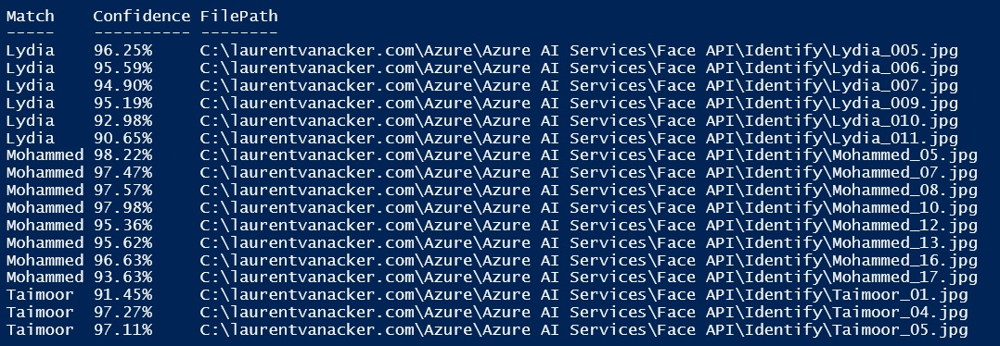

# Azure AI Services > Face API

Table of content:

- [Azure AI Services \> Face API](#azure-ai-services--face-api)
- [Preliminary Remarks](#preliminary-remarks)
- [Face API](#face-api)
  - [Test-AzFaceAPIFaceIdentify.ps1](#test-azfaceapifaceidentifyps1)
  - [Test-AzFaceAPI.ps1](#test-azfaceapips1)
  - [Some demo pictures](#some-demo-pictures)

# Preliminary Remarks

All scripts are standalone scripts and will create and use their own related Azure AI Services resources (Free if possible).

# Face API

***To use the features Identification and Verification you have to apply for access at [https://aka.ms/facerecognition](https://aka.ms/facerecognition)***

## Test-AzFaceAPIFaceIdentify.ps1

The [Test-AzFaceAPIFaceIdentify.ps1](Test-AzFaceAPIFaceIdentify.ps1) script is able to identify a picture of a person after a training.  

- In the "Training" folder, I created a subfolder per person (the folder name is the supposed first name of this person and it is used for future identification/matching) with some pictures of the person. These pictures are used to train the Face API. I specified the person name in the file name only for a better understanding.

- The "Identify" folder contains non-sorted pictures of persons to identify. The script will try to identify the person on the picture based on the training done before. I also specified the person name in the file name only for a better understanding.

At the end of the script, the results are displayed in the console with the first name (based on the subfolder name under the "Training" folder) and the confidence (expressed in percents) and the file path of the identified picture as shown below:

To summarize, the processing order and the used resources are :
[Face - Detect](https://eastus.dev.cognitive.microsoft.com/docs/services/563879b61984550e40cbbe8d/operations/563879b61984550f30395236) > [Person Group - Create](https://eastus.dev.cognitive.microsoft.com/docs/services/563879b61984550e40cbbe8d/operations/563879b61984550f30395244) > [Person - Create](https://eastus.dev.cognitive.microsoft.com/docs/services/563879b61984550e40cbbe8d/operations/563879b61984550f3039523c) > [Person - Add Face](https://eastus.dev.cognitive.microsoft.com/docs/services/563879b61984550e40cbbe8d/operations/563879b61984550f3039523b) > [Person Group - Train](https://eastus.dev.cognitive.microsoft.com/docs/services/563879b61984550e40cbbe8d/operations/563879b61984550f30395249) > [Face - Identify](https://eastus.dev.cognitive.microsoft.com/docs/services/563879b61984550e40cbbe8d/operations/563879b61984550f30395239)

## Test-AzFaceAPI.ps1

The [Test-AzFaceAPI.ps1](Test-AzFaceAPI.ps1) script is a working version of the [Test-AzFaceAPIFaceIdentify.ps1](Test-AzFaceAPIFaceIdentify.ps1) script with more features and options (The [Test-AzFaceAPIFaceIdentify.ps1](Test-AzFaceAPIFaceIdentify.ps1) script is a subset of this script with only the required features for the identification.).
In this script, I added the following features for testing purposes:

- [FaceList - Create](https://eastus.dev.cognitive.microsoft.com/docs/services/563879b61984550e40cbbe8d/operations/563879b61984550f3039524b): I create 2 FaceLists (one for the training and one for the identification).

- [FaceList - Add Face](https://eastus.dev.cognitive.microsoft.com/docs/services/563879b61984550e40cbbe8d/operations/563879b61984550f3039524c): I add the pictures of the persons in the "Training" folder to the FaceList for training. The FaceList for identification is used to identify the persons in the pictures of the "Identification" folder.

- [Face - Find Similar](https://eastus.dev.cognitive.microsoft.com/docs/services/563879b61984550e40cbbe8d/operations/563879b61984550f30395237): I use this feature to find similarities between the pictures of the 2 previously created FaceLists. I also use this feature to find similarities between the pictures of 2 different [Face - Detect](https://eastus.dev.cognitive.microsoft.com/docs/services/563879b61984550e40cbbe8d/operations/563879b61984550f30395236) runs (one for the "Identification" folder and one for the "Training" Folder).
  
## Some demo pictures

***Remark***: These pictures are for illustration and demonstration and come from the Microsoft library used for presentations and deliverables.

