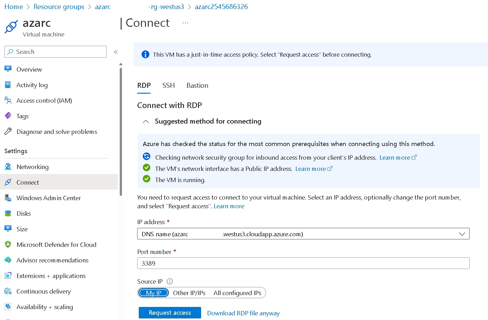

# Azure Arc

The [1 - Azure VM as Azure Arc Server.ps1](1%20-%20Azure%20VM%20as%20Azure%20Arc%20Server.ps1) script creates an Azure VM seen as an Azure Arc Server. 

### Prerequisites 

  * An [Azure](https://portal.azure.com) Subscription

### Setup

Run the [1 - Azure VM as Azure Arc Server.ps1](1%20-%20Azure%20VM%20as%20Azure%20Arc%20Server.ps1) script (PowerShell 5.1 needed) wait for completion (~15 minutes).

**Notes:**
* If you are already connected (via [Connect-Azaccount](https://learn.microsoft.com/en-us/powershell/module/az.accounts/connect-azaccount)) to the right Azure subscription (mentionned around the line 65 - change to reflect your subscription name) this setup will be fully unattended else you will be asked to connect and to select the right subscription. 
* The Azure VM will run the latest version of 'Windows Server 2022 Datacenter (Desktop Experience)' Generation 2 in a [Standard_D4s_v5](https://learn.microsoft.com/en-us/azure/virtual-machines/dv5-dsv5-series) Azure VM.
* The Azure VM will be a [Spot Instance](https://learn.microsoft.com/en-us/azure/virtual-machines/spot-vms) with a 'Deallocate' [eviction policy](https://learn.microsoft.com/en-us/azure/architecture/guide/spot/spot-eviction#eviction-policy) based on capacity (not price) to save money. You can disable that if you want (around line 185 in the [1 - Azure VM as Azure Arc Server.ps1](1%20-%20Azure%20VM%20as%20Azure%20Arc%20Server.ps1) script).
* The WM will be deployed on the westus3 region for cost saving purpose (You can use the non Microsoft https://azureprice.net/ web site to compare cost in different regions) . You can change  that if you want (around line 79 in the [1 - Azure VM as Azure Arc Server.ps1](1%20-%20Azure%20VM%20as%20Azure%20Arc%20Server.ps1) script).
* The VM name (and associated Storage account name) is randomly generated with the template azarcXXXXXXXXXX where X is a digit to avoid duplicate names (an availability test is done around line 82 in the [1 - Azure VM as Azure Arc Server.ps1](1%20-%20Azure%20VM%20as%20Azure%20Arc%20Server.ps1) script).
* A DNS Name is set under the form \<VMName\>.\<Location\>.cloudapp.azure.com (for instance azarc3141592653.westus3.cloudapp.azure.com) and used for the browser connection (the pblic IP is not directly used).
* A daily scheduled shutdown at 11:00 PM (in your local timezone) is set for the VM (no automatic start is set).
* The RDP and HTTP connections are only accessible from the IP where you run the script (done via a query to http://ifconfig.me/ip) via a [Network Security Group](https://learn.microsoft.com/en-us/azure/virtual-network/network-security-group-how-it-works). If you want to give access to people from different IP you has to customize the RDP and HTTP rules of the NSG or use the JIT access policy (next point).

* A just-in-time access policy (3-hour long) is also set for RDP access.

* The password (for RDP connection) is randomly generated and displayed at the beginning and copied into your clipboard. The account name used is the same you are currently using (cf. the Username environment variable - so almost different for everyone). In addition these credentials will also be displayed at the end of the deployment process (in green).
* A RDP session will be automatically opened at the end of the deployment process and the browser will be opened on the [Azure Arc Server page](https://portal.azure.com/#blade/HubsExtension/BrowseResource/resourceType/Microsoft.HybridCompute%2Fmachines). 