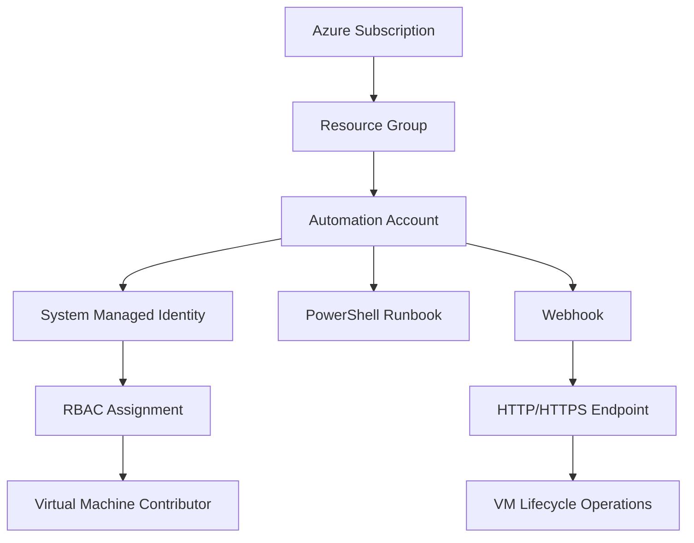

# Azure Automation Account: VM Start Setup

This repository contains enterprise-ready PowerShell scripts for setting up a complete Azure Automation infrastructure to start virtual machine via webhooks.
> [!NOTE]
> It acts as a Proof of Concept (POC) for a customer of mine.

## 🚀 Features

### New-ManageAzureVirtualMachineRunBook.ps1
- **Complete Infrastructure Deployment**: Automatically creates Resource Groups, Automation Accounts, Runbooks, and Webhooks
- **Enterprise Naming Conventions**: Follows Azure Cloud Adoption Framework naming standards
- **Managed Identity Integration**: Configures system-assigned managed identity with appropriate RBAC permissions
- **Automated Testing Framework**: Includes comprehensive validation and testing capabilities
- **Error Handling & Retry Logic**: Robust error handling with retry mechanisms for reliability
- **Security Best Practices**: Secure webhook URI handling and proper authentication flows

### ManageAzureVirtualMachineRunBook.ps1
- **Enterprise-Grade VM Management**: Comprehensive PowerShell runbook for VM lifecycle operations
- **Webhook Integration**: Secure webhook processing with validation and authentication
- **Parallel Processing**: Background jobs for efficient multi-VM operations
- **Comprehensive Monitoring**: Detailed logging, progress tracking, and results reporting
- **Error Resilience**: Individual VM error handling with detailed reporting

## 📋 Prerequisites

### System Requirements
- **PowerShell**: Version 5.1 or later
- **Azure PowerShell Modules**:
  - `Az.Accounts` (authentication)
  - `Az.Automation` (automation account management)
  - `Az.Resources` (resource management)
  - `Az.Compute` (virtual machine operations)

### Azure Requirements
- Valid Azure subscription
- Appropriate RBAC permissions:
  - `Contributor` or `Owner` role on subscription or resource group
  - Ability to create managed identities
  - Ability to assign RBAC roles

### Installation Commands
```powershell
# Install required Azure PowerShell modules
Install-Module -Name Az.Accounts, Az.Automation, Az.Resources, Az.Compute -Force -AllowClobber

# Connect to Azure
Connect-AzAccount
```

## 🎯 Quick Start

### Basic Deployment
```powershell
# Deploy with default settings (East US, automation project, startvm role)
.\New-ManageAzureVirtualMachineRunBook.ps1
```

### Custom Configuration
```powershell
# Deploy to West Europe with custom project and role names
.\New-ManageAzureVirtualMachineRunBook.ps1 -Location "WestEurope" -Project "prod" -Role "vmops"
```

### Production Deployment
```powershell
# Force removal of existing resources and skip testing
.\New-ManageAzureVirtualMachineRunBook.ps1 -Location "EastUS2" -Force -SkipTesting
```

## ⚙️ Configuration Parameters

| Parameter     | Type   | Default      | Description                                 |
| ------------- | ------ | ------------ | ------------------------------------------- |
| `Location`    | String | `EastUS`     | Azure region for resource deployment        |
| `Project`     | String | `automation` | Project identifier for naming convention    |
| `Role`        | String | `startvm`    | Role identifier for naming convention       |
| `SkipTesting` | Switch | `False`      | Skip automated testing after deployment     |
| `Force`       | Switch | `False`      | Remove existing resources without prompting |

### Supported Azure Regions
The script supports all major Azure regions with automatic short-name mapping:
- **US Regions**: EastUS, EastUS2, WestUS, WestUS2, WestUS3, CentralUS, etc.
- **Europe Regions**: NorthEurope, WestEurope, UKSouth, UKWest, FranceCentral, etc.
- **Asia Pacific**: EastAsia, SoutheastAsia, JapanEast, JapanWest, etc.
- **Other Regions**: CanadaCentral, BrazilSouth, AustraliaEast, etc.

## 🏗️ Architecture Overview



### Resource Naming Convention
Following the Azure Cloud Adoption Framework:
```
Format: {prefix}-{project}-{role}-{location}-{instance}
Examples:
- Resource Group: rg-automation-startvm-use-001
- Automation Account: aa-automation-startvm-use-001
- Runbook: runbk-StopStartAzureVirtualMachine
- Webhook: wbhk-automation-startvm-use-001
```

## 🔧 Webhook Usage

### Webhook Payload Format
```json
[
  {
    "Name": "vm-web-01",
    "ResourceGroupName": "rg-production-web"
  },
  {
    "Name": "vm-app-01",
    "ResourceGroupName": "rg-production-app"
  }
]
```

### Making Webhook Calls
```powershell
# Example webhook invocation
$vmList = @(
    @{ Name = "vm-web-01"; ResourceGroupName = "rg-production" }
    @{ Name = "vm-app-01"; ResourceGroupName = "rg-production" }
)

$body = $vmList | ConvertTo-Json
$response = Invoke-RestMethod -Uri $webhookURI -Method Post -Body $body -ContentType "application/json"
```

### Response Format
```json
{
  "jobids": ["12345678-1234-1234-1234-123456789012"]
}
```

## 📊 Monitoring and Logging

### Job Monitoring
```powershell
# Monitor automation job
$job = Get-AzAutomationJob -AutomationAccountName $automationAccount -Id $jobId -ResourceGroupName $resourceGroup

# Get job output
$output = Get-AzAutomationJobOutput -AutomationAccountName $automationAccount -Id $jobId -ResourceGroupName $resourceGroup -Stream Output
```

### Logging Levels
- **Verbose**: Detailed operation steps and progress
- **Information**: Key milestone achievements
- **Warning**: Non-critical issues and fallback operations
- **Error**: Critical failures requiring attention

## 🛡️ Security Considerations

### Managed Identity
- **System-Assigned Identity**: Automatically created and managed by Azure
- **Least Privilege**: Only `Virtual Machine Contributor` role assigned
- **Scope Limitation**: Permissions scoped to subscription level

### Webhook Security
- **Unique URLs**: Each webhook has a unique, hard-to-guess URL
- **HTTPS Only**: All webhook communications encrypted in transit
- **Expiration Management**: 10-year default expiration with renewal capabilities

### Best Practices
1. **Store Webhook URIs Securely**: Use Azure Key Vault or secure configuration management
2. **Monitor Access**: Enable Azure Monitor and alerting for automation accounts
3. **Regular Audits**: Review RBAC assignments and webhook usage patterns
4. **Rotate Credentials**: Regenerate webhook URIs periodically

## 🔍 Troubleshooting

### Common Issues

#### Authentication Failures
```powershell
# Verify Azure context
Get-AzContext

# Re-authenticate if needed
Connect-AzAccount -Force
```

#### RBAC Assignment Delays
- **Issue**: Managed identity not found during RBAC assignment
- **Solution**: Script includes automatic retry logic with 60-second delay
- **Manual Fix**: Wait for identity propagation (up to 5 minutes)

#### Resource Group Conflicts
```powershell
# Use Force parameter to automatically remove existing resources
.\New-ManageAzureVirtualMachineRunBook.ps1 -Force
```

#### Webhook Execution Failures
1. **Verify Payload Format**: Ensure JSON structure matches expected format
2. **Check VM Permissions**: Confirm managed identity has access to target VMs
3. **Monitor Job Logs**: Review automation job output for detailed error messages

### Diagnostic Commands
```powershell
# Check automation account status
Get-AzAutomationAccount -ResourceGroupName $resourceGroupName

# Verify runbook deployment
Get-AzAutomationRunbook -AutomationAccountName $automationAccountName -ResourceGroupName $resourceGroupName

# List webhook configuration
Get-AzAutomationWebhook -AutomationAccountName $automationAccountName -ResourceGroupName $resourceGroupName

# Review RBAC assignments
Get-AzRoleAssignment -Scope "/subscriptions/$subscriptionId" | Where-Object { $_.ObjectType -eq "ServicePrincipal" }
```

## 🚀 Advanced Configuration

### Custom Runbook Deployment
```powershell
# Deploy custom runbook from different repository
$customURI = "https://raw.githubusercontent.com/yourrepo/custom-runbook.ps1"
# Modify the script to use your custom URI
```

### Multiple Environment Support
```powershell
# Development environment
.\New-ManageAzureVirtualMachineRunBook.ps1 -Project "dev" -Location "EastUS"

# Production environment  
.\New-ManageAzureVirtualMachineRunBook.ps1 -Project "prod" -Location "WestUS2"
```

### Integration with CI/CD
```yaml
# Azure DevOps Pipeline example
- task: AzurePowerShell@5
  displayName: 'Deploy Automation Infrastructure'
  inputs:
    azureSubscription: '$(ServiceConnection)'
    ScriptType: 'FilePath'
    ScriptPath: '$(System.DefaultWorkingDirectory)/New-ManageAzureVirtualMachineRunBook.ps1'
    ScriptArguments: '-Location "$(DeploymentRegion)" -Project "$(ProjectName)" -Force -SkipTesting'
    azurePowerShellVersion: 'LatestVersion'
```

## 📚 Additional Resources

### Microsoft Documentation
- [Azure Automation Overview](https://docs.microsoft.com/en-us/azure/automation/)
- [Webhook Documentation](https://docs.microsoft.com/en-us/azure/automation/automation-webhooks)
- [Managed Identity Guide](https://docs.microsoft.com/en-us/azure/active-directory/managed-identities-azure-resources/)

### Azure Cloud Adoption Framework
- [Naming Conventions](https://docs.microsoft.com/en-us/azure/cloud-adoption-framework/ready/azure-best-practices/naming-and-tagging)
- [Security Best Practices](https://docs.microsoft.com/en-us/azure/cloud-adoption-framework/secure/)

### PowerShell Resources
- [Azure PowerShell Documentation](https://docs.microsoft.com/en-us/powershell/azure/)
- [PowerShell Best Practices](https://docs.microsoft.com/en-us/powershell/scripting/dev-cross-plat/writing-portable-cmdlets)

## 🤝 Contributing

1. **Fork the Repository**: Create your own copy for modifications
2. **Create Feature Branch**: `git checkout -b feature/enhancement-name`
3. **Follow Standards**: Maintain PowerShell and Azure best practices
4. **Test Thoroughly**: Validate changes in test environments
5. **Submit Pull Request**: Include detailed description of changes

## 📄 License

This project is provided under the MIT License. See the LICENSE file for details.

## ⚠️ Disclaimer

This sample code is provided for illustration purposes only and is not intended for production use without proper testing and validation. Always review and adapt the code to meet your specific requirements and security policies.

---

**Authors**: Laurent Vanacker  
**Version**: 2.0.0  
**Last Updated**: October 2025  
**Repository**: [laurentvanacker.com](https://github.com/lavanack/laurentvanacker.com)
