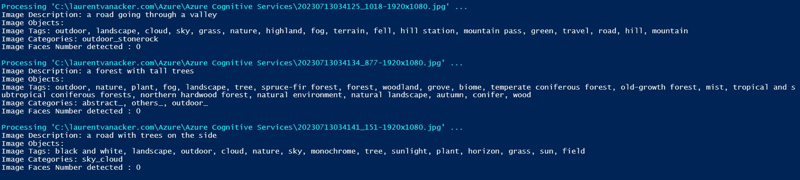

# Azure Cognitives Services

Table of content:

- [Azure Cognitives Services](#azure-cognitives-services)
- [Computer Vision](#computer-vision)
  - [Some examples](#some-examples)

# Computer Vision

The [Test-AzComputerVisionImageAnalysis.ps1](Test-AzComputerVisionImageAnalysis.ps1) script downloads 3 random pictures (1920x1080) from [https://picsum.photos/](https://picsum.photos/) and use the [Computer Vision > Image Analysis](https://learn.microsoft.com/en-us/azure/cognitive-services/computer-vision/overview-image-analysis?tabs=4-0) of [Azure Cognitive Services](https://learn.microsoft.com/en-us/azure/cognitive-services/) to analyze the downloaded pictures.

For that, it will create a dedicated resource group with a Free (Only one free tier (F0) per subscription) Cognitive Service. If you already have set up one, the script will failed and stop (around line 142).

The script will return
- A [photo description](https://learn.microsoft.com/en-us/azure/cognitive-services/computer-vision/concept-describing-images)
- The [detected objets](https://learn.microsoft.com/en-us/azure/cognitive-services/computer-vision/concept-object-detection)  
- The [tags](https://learn.microsoft.com/en-us/azure/cognitive-services/computer-vision/concept-tagging-images) for the recognized objects
- The [image categorization](https://learn.microsoft.com/en-us/azure/cognitive-services/computer-vision/concept-categorizing-images)
- The [detected face(s)](https://learn.microsoft.com/en-us/azure/cognitive-services/computer-vision/concept-detecting-faces) (if applicable)

## Some examples
Judge by yourself with 3 examples ;)

