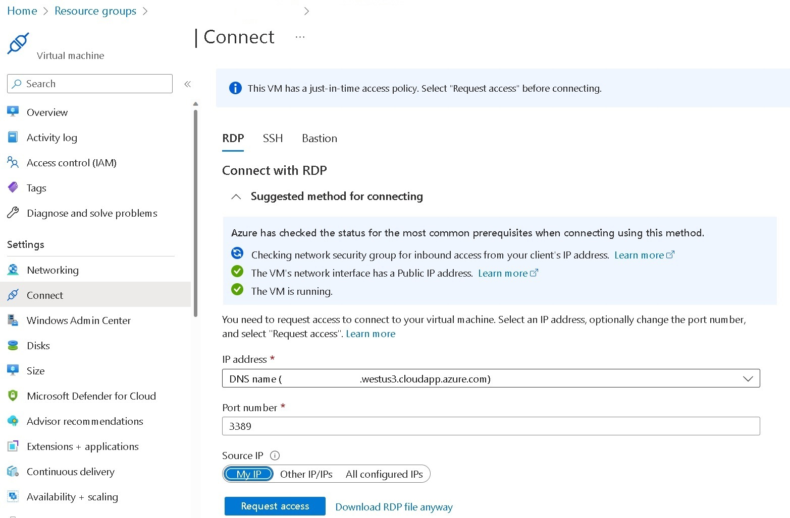

# Azure VM with IIS in Docker and Azure Container Registry

- [Azure VM with IIS in Docker and Azure Container Registry](#azure-vm-with-iis-in-docker-and-azure-container-registry)
  - [Azure VM with IIS in Docker and Azure Container Registry.ps1](#azure-vm-with-iis-in-docker-and-azure-container-registryps1)
  - [DockerSetup.ps1](#dockersetupps1)
  - [IISSetup.ps1](#iissetupps1)

## Azure VM with IIS in Docker and Azure Container Registry.ps1

The[Azure VM with IIS in Docker and Azure Container Registry.ps1](<Azure VM with IIS in Docker and Azure Container Registry.ps1>) script creates an Azure VM with Docker installed (cf. [DockerSetup.ps1](#dockersetupps1)) and using a Docker image with IIS installed and customized (cf. [IISSetup.ps1](#iissetupps1)). The script also creates an Azure Container Registry and pushes the used image to it.

There are two optional parameters

- `$IISWebSitePort`: The TCP ports to be used by the IIS websites on the Azure VM/Docker host (port 80 will be used in the containers). The default value is 80, 81 and 82. The ports you'll specify will be the number of containers that wil be created. So by default, the script will create 3 containers with the same image and the containerized IIS image will be publicly available via the 80, 81 and 82 ports of the Azure VM.
- `$ImageName`: The name we will give to the docker image (default is `iis-website`).

## DockerSetup.ps1

The [DockerSetup.ps1](DockerSetup.ps1) has two optional and a mandatory parameters (The value are passed from the main script to this one)

- Optional ones (same as the [Azure VM with IIS in Docker and Azure Container Registry.ps1](<Azure VM with IIS in Docker and Azure Container Registry.ps1>) script)
  - `$IISWebSitePort`
  - `$ImageName`
- Mandatory one
  - `$ContainerRegistryName`: The name of the Azure Container Registry where the image will be pushed.

The goal of this script is  to

- Install Docker on the Azure VM
- Create a Docker image with IIS installed and customized (via the [IISSetup.ps1](IISSetup.ps1) script). The [mcr.microsoft.com/windows/servercore/iis](https://hub.docker.com/_/microsoft-windows-servercore-iis) image is used.
- Use this image to create 3 containers (by default) with the same image and to expose the internal port (TCP/80) of the container to the host via the ports specified `$IISWebSitePort` parameter.
- Push the created image to the Azure Container Registry created by the main script
It also installs the IIS Management Console on the Azure VM for a remote administration of the created containers.

## IISSetup.ps1

The [IISSetup.ps1](IISSetup.ps1) script is used to customize IIS inside the container(s). Among other things, it installs or configure the following features:

- Installation
  - IIS Management Service
  - ASP.Net 4.5+
  - Failed Request Tracing
  - Request Monitor
- Configuration
  - IIS Management Service
  - IIS Logging Fields
  - Default Application Pool Settings
  - IIS Event Log
  - A remote Management User (member of the local` Administrators group). You will be able to connect from the Azure VM tpo the Docker container via the IIS Management Service.
  
This script is the same the one you can find [here](/Windows%20Powershell/IIS/AutomatedLab/Docker/Hyper-V/).

> [!NOTE]
>
> - If you are already connected (via [Connect-AzAccount](https://learn.microsoft.com/en-us/powershell/module/az.accounts/connect-azaccount)) to the right Azure subscription (mentionned around the line 110 - change to reflect your subscription name) this setup will be fully unattended else you will be prompted to connect and to select the right subscription.
> - The Azure VM will run the latest version of 'Windows Server 2022 Datacenter (Desktop Experience)' Generation 2 in a [Standard_D4s_v5](https://learn.microsoft.com/en-us/azure/virtual-machines/dv5-dsv5-series) Azure VM.
> - The Azure VM will be a [Spot Instance](https://learn.microsoft.com/en-us/azure/virtual-machines/spot-vms) with a 'Deallocate' [eviction policy](https://learn.microsoft.com/en-us/azure/architecture/guide/spot/spot-eviction#eviction-policy) based on capacity (not price) to save money. You can disable that if you want.
> - The VM will be deployed on the eastus region (You can use the non Microsoft <https://cloudprice.net/> web site to compare cost in different regions for cost savings) . You can change  that if you want .
> - The VM name is randomly generated with the template vmdkracrYYYXXXX where YYY and a 3-letter acronym for the Azure location and X is a digit to avoid duplicate names (an availability test is done in the main script). A global naming convention is also set for all Azure resources.
> - A DNS Name is set under the form \<VMName\>.\<Location\>.cloudapp.azure.com (for instance dscazamc31415926.westus3.cloudapp.azure.com) and used for the browser connection (the pblic IP is not directly used).
> - A daily scheduled shutdown at 11:00 PM (in your local timezone) is set for the VM (no automatic start is set).
> - The RDP connection is only accessible from the IP where you run the script (done via a query to <https://ipv4.seeip.org>) via a [Network Security Group](https://learn.microsoft.com/en-us/azure/virtual-network/network-security-group-how-it-works). If you want to give access to people from different IP you has to customize the RDP rule of the NSG or use the JIT access policy (next point).

> - A just-in-time access policy (3-hour long) is also set for RDP access.

> - The HTTP and HTTPS connections (TCP/80, TCP/81, TCP/82 and TCP/443) are accessible from everywhere.  Based on the ports you have chosen for the IIS websites (`$IISWebSitePort` parameter), the associated NSG rule is customized.
> - The password (for RDP connection) is randomly generated and displayed at the beginning and copied into your clipboard. The account name used is the same you are currently using (cf. the Username environment variable - so almost different for everyone). In addition these credentials will also be displayed at the end of the deployment process (in green) and added in the Credential Manager for an automatic connection in the upcoming RDP session (next point).
>
> - A RDP session will be automatically opened at the end of the deployment process.
> - A browser session will be automatically opened at the end of the deployment process with a connection to the containers via the Public IP of the Azure VM (Docker host).

