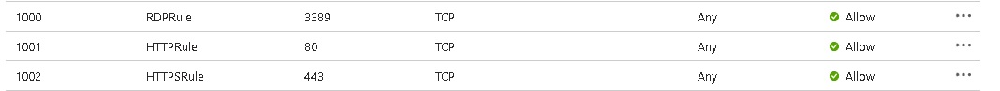
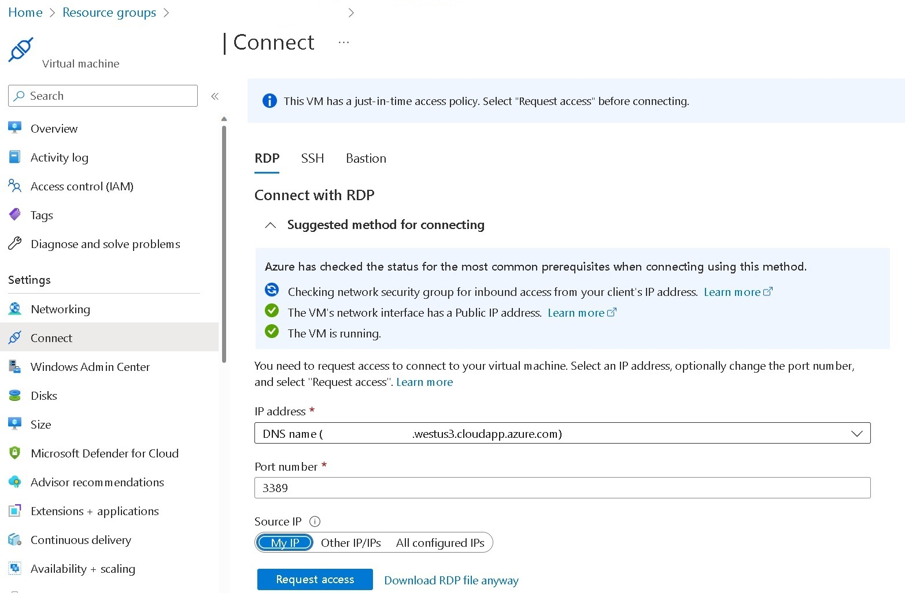

# Azure Monitor - Data Collection Rules

- [Azure Monitor - Data Collection Rules](#azure-monitor---data-collection-rules)
  - [AzureVM - Data Collection Rules.ps1](#azurevm---data-collection-rulesps1)
    - [Purpose](#purpose)
    - [Parameters](#parameters)
      - [PerformanceCountersFilePath](#performancecountersfilepath)
      - [EventLogsFilePath](#eventlogsfilepath)
    - [Additional information](#additional-information)

## AzureVM - Data Collection Rules.ps1

### Purpose

The [AzureVM - Data Collection Rules.ps1](<AzureVM - Data Collection Rules.ps1>) PowerShell script creates an Azure Virtual machine running `Windows Server 20222 - DataCenter` with the [Azure Monitor Agent](https://learn.microsoft.com/en-us/azure/azure-monitor/agents/agents-overview) extension installed. A [Data collection Rule](https://learn.microsoft.com/en-us/azure/azure-monitor/essentials/data-collection-rule-overview) is also created to collect some Windows Event Logs and Performance Counters and send them to a dedicated Log Analytics Workspace.

### Parameters

The following parameters are optional. When omitted, default values are used (hard-coded in the [AzureVM - Data Collection Rules.ps1](<AzureVM - Data Collection Rules.ps1>) PowerShell script).

#### PerformanceCountersFilePath

This parameter allows to specify either a CSV or a JSON file with the performance counters you want to collect. You can use either [PerformanceCounters.csv](PerformanceCounters.csv) or [PerformanceCounters.json](PerformanceCounters.json) files as examples.

#### EventLogsFilePath

This parameter allows to specify either a CSV or a JSON file with the event logs  you want to collect. You can use either [EventLogs.csv](EventLogs.csv) or [EventLogs.json](EventLogs.json) files as examples.

### Additional information

- If you are already connected (via [Connect-Azaccount](https://learn.microsoft.com/en-us/powershell/module/az.accounts/connect-azaccount)) to the right Azure subscription, this setup will be fully unattended else you will be asked to connect and to select the right subscription.
- The Azure VM will run the latest version of 'Windows Server 2022 Datacenter (Desktop Experience)' Generation 2 in a [Standard_D4s_v5](https://learn.microsoft.com/en-us/azure/virtual-machines/dv5-dsv5-series) Azure VM.
- The Azure VM will be a [Spot Instance](https://learn.microsoft.com/en-us/azure/virtual-machines/spot-vms) with a 'Deallocate' [eviction policy](https://learn.microsoft.com/en-us/azure/architecture/guide/spot/spot-eviction#eviction-policy) based on capacity (not price) to save money. You can disable that if you want.
- The WM will be deployed on the eastus region (You can use the non Microsoft <https://azureprice.net/> web site to compare cost in different regions) . You can change  that if you want.
- We rely on <https://github.com/microsoft/CloudAdoptionFramework/tree/master/ready/AzNamingTool> for the naming convention of all Azure resources. We append a random number (the same for all resources in the only resource group we used) at the end to avoid duplicate names.
- A DNS Name is set under the form \<VMName\>.\<Location\>.cloudapp.azure.com and used for the browser connection (the public IP is not directly used).
- A daily scheduled shutdown at 11:00 PM (in your local timezone) is set for the VM (no automatic start is set).
- The RDP connection is only accessible from the IP where you run the script (done via a query to <http://ifconfig.me/ip>) via a [Network Security Group](https://learn.microsoft.com/en-us/azure/virtual-network/network-security-group-how-it-works). If you want to give access to people from different IP you has to customize the RDP rule of the NSG or use the JIT access policy (next point).

- The HTTP/HTTPS connection (TCP/80 and TCP/443) is also only accessible from the IP where you run the script.
- A just-in-time access policy (3-hour long) is also set for RDP access.

- The password (for RDP connection) is randomly generated and displayed at the beginning and copied into your clipboard. The account name used is the same you are currently using (cf. the Username environment variable - so almost different for everyone). In addition these credentials will also be displayed at the end of the deployment process (in green) and added in the Credential Manager for an automatic connection in the upcoming RDP session (next point).
- A RDP session will be automatically opened at the end of the deployment process and the browser will be opened to the IIS website
