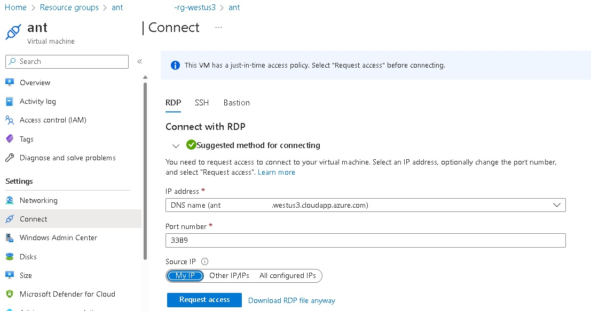

# Azure Naming Tool

Table of content:
- [Azure Naming Tool](#azure-naming-tool)
  - [Context](#context)
  - [Azure Version](#azure-version)
    - [Prerequisites](#prerequisites)
    - [Setup](#setup)
  - [AutomatedLab version](#automatedlab-version)
    - [Prerequisites](#prerequisites-1)
  - [Api Test](#api-test)

## Context

[Azure Naming Tool ](https://github.com/microsoft/CloudAdoptionFramework/tree/master/ready/AzNamingTool) (part of the Microsoft [CloudAdoptionFramework](https://github.com/microsoft/CloudAdoptionFramework)) was developed using a naming pattern based on [Microsoft's best practices](https://learn.microsoft.com/en-us/azure/cloud-adoption-framework/ready/azure-best-practices/naming-and-tagging). Once an administrator has defined the organizational components, users can use the tool to generate a name for the desired Azure resource.
I proposed here two versions for deploying this tool: via [AutomatedLab](#automatedlab-version) and directly inside an [Azure](#azure-version) VM ([Run as a Stand-Alone Site](https://github.com/microsoft/CloudAdoptionFramework/blob/master/ready/AzNamingTool/INSTALLATION.md#run-as-a-stand-alone-site) inside IIS in both cases with only anonymous authentication - you can change that if your want) 

## Azure Version

### Prerequisites 

  * An [Azure](https://portal.azure.com) Subscription

### Setup

Run the [AzureNamingToolAzVM.ps1](AzureNamingToolAzVM.ps1) script (PowerShell 5.1 needed) wait for completion (~10 minutes).
After completion the website will automatically be open via your default browser. 

**Notes:**
* If you are already connected (via [Connect-Azaccount](https://learn.microsoft.com/en-us/powershell/module/az.accounts/connect-azaccount)) to the right Azure subscription (mentionned around the line 65 - change to reflect your subscription name) this setup will be fully unattended else you will be asked to connect and to select the right subscription. 
* The Azure VM will run the latest version of 'Windows Server 2022 Datacenter (Desktop Experience)' Generation 2 in a [Standard_D4s_v5](https://learn.microsoft.com/en-us/azure/virtual-machines/dv5-dsv5-series) Azure VM.
* The Azure VM will be a [Spot Instance](https://learn.microsoft.com/en-us/azure/virtual-machines/spot-vms) with a 'Deallocate' [eviction policy](https://learn.microsoft.com/en-us/azure/architecture/guide/spot/spot-eviction#eviction-policy) based on capacity (not price) to save money. You can disable that if you want (around line 185 in the [AzureNamingToolAzVM.ps1](AzureNamingToolAzVM.ps1) script).
* The WM will be deployed on the westus3 region for cost saving purpose (You can use the non Microsoft https://azureprice.net/ web site to compare cost in different regions) . You can change  that if you want (around line 79 in the [AzureNamingToolAzVM.ps1](AzureNamingToolAzVM.ps1) script).
* The VM name (and associated Storage account name) is randomly generated with the template antXXXXXXXXXXXX where X is a digit to avoid duplicate names (an availability test is done around line 82 in the [AzureNamingToolAzVM.ps1](AzureNamingToolAzVM.ps1) script)
* A DNS Name is set under the form \<VMName\>.\<Location\>.cloudapp.azure.com (for instance ant314159265359.westus3.cloudapp.azure.com) and used for the browser connection (the pblic IP is not directly used).
* A daily scheduled shutdown at 11:00 PM (in your local timezone) is set for the VM (no automatic start is set)
* The RDP and HTTP connections are only accessible from the IP where you run the script (done via a query to http://ifconfig.me/ip) via a [Network Security Group](https://learn.microsoft.com/en-us/azure/virtual-network/network-security-group-how-it-works). If you want to give access to people from different IP you has to customize the RDP and HTTP rules of the NSG or use the JIT access policy (next point).

* A just-in-time access policy (3-hour long) is also set for RDP access.

* The password (for RDP connection) is randomly generated and displayed at the beginning and copied into your clipboard. The account name used is the same you are currently using (cf. the Username environment variable - so almost different for everyone). In addition these credentials will also be displayed at the end of the deployment process (in green) and added in the Credential Manager for an automatic connection in the upcoming RDP session (next point).
* A RDP session will be automatically opened at the end of the deployment process (just enter the displayed credentials). 
  
The final step is to immediately set your Azure Naming Tool Admin Password. (Be careful if you are behind a proxy because everyone using the same proxy wil be able to reach the website and set this password before you if you don't do it quicky).

## AutomatedLab version

[AutomatedLab](https://automatedlab.org) ([GitHub](https://github.com/AutomatedLab/AutomatedLab)) is a project that allows to set up lab and test environments on **Hyper-V** or **[Azure](https://portal.azure.com/)** with multiple products.
### Prerequisites 

Run the [AutomatedLab - Azure Naming Tool - IIS - WS2022.ps1.ps1](./AutomatedLab%20-%20Azure%20Naming%20Tool%20-%20IIS%20-%20WS2022.ps1) script (PowerShell 5.1 needed) wait for completion (~30 minutes).
After completion you'll have:
* a Domain Controller for the contoso.com domain: DC01.
* an IIS server for hosting the azurenamingtool.contoso.com website: IIS01.

All Windows Servers are running 'Windows Server 2022 Datacenter (Desktop Experience)'. Credentials will be displayed at the end of the deployment process. Just connect via RDP to the server you want (DC01 or IIS01) and open an Edge browser. The https://azurenamingtool.contoso.com will automatically be loaded (Thanks to GPO settings). (There is no authentication mechanism except the anonymous one.). The final step is to set your Azure Naming Tool Admin Password.

## Api Test
The script [AzureNamingToolAPI.ps1](AzureNamingToolAPI.ps1) is a sample script for testing the API of the Azure Naming Tool. Among the things the script does, it will generate random names for all kind of Azure resources based on the [Azure Naming Tool ](https://github.com/microsoft/CloudAdoptionFramework/tree/master/ready/AzNamingTool) configuration.