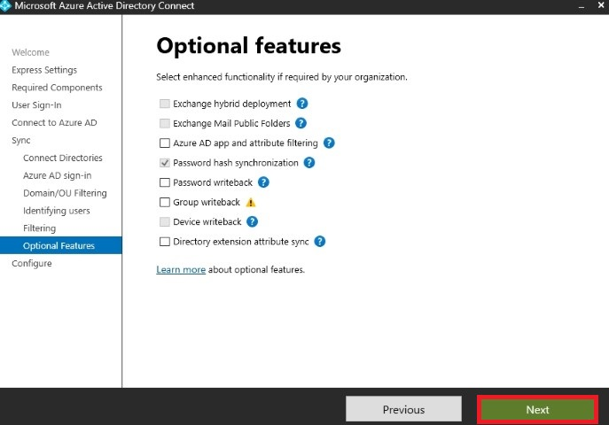

# Azure Active Directory Hybrid Lab - PowerShell version

- [Azure Active Directory Hybrid Lab - PowerShell version](#azure-active-directory-hybrid-lab---powershell-version)
  - [Preliminary Note(s)](#preliminary-notes)
  - [New-AAD-Hybrid-Lab.ps1: Step-by-step guide](#new-aad-hybrid-labps1-step-by-step-guide)
  - [New-AAD-Hybrid-BCDR-Lab.ps1: Step-by-step guide](#new-aad-hybrid-bcdr-labps1-step-by-step-guide)

## Preliminary Note(s)

- The [New-AAD-Hybrid-Lab.ps1](https://github.com/lavanack/laurentvanacker.com/blob/master/Azure/Azure%20Virtual%20Desktop/AAD-Hybrid-Lab%20-%20PowerShell/New-AAD-Hybrid-Lab.ps1) script has the same functionality same the lab available on [https://github.com/lavanack/laurentvanacker.com/tree/master/Azure/Azure%20Virtual%20Desktop/AAD-Hybrid-Lab](https://github.com/lavanack/laurentvanacker.com/tree/master/Azure/Azure%20Virtual%20Desktop/AAD-Hybrid-Lab) but in a full Powershell version  instead of using ARM templates. The default values remain the same as the original version (ARM-based) with one exception: you can optionally deploy Azure Bastion (cf. parameters at the end of the [New-AAD-Hybrid-Lab.ps1](https://github.com/lavanack/laurentvanacker.com/blob/master/Azure/Azure%20Virtual%20Desktop/AAD-Hybrid-Lab%20-%20PowerShell/New-AAD-Hybrid-Lab.ps1) script). Feel free to customize the values to your needs (some explanations are available [below](#new-aad-hybrid-labps1-step-by-step-guide)).

- The [New-AAD-Hybrid-BCDR-Lab.ps1](https://github.com/lavanack/laurentvanacker.com/blob/master/Azure/Azure%20Virtual%20Desktop/AAD-Hybrid-Lab%20-%20PowerShell/New-AAD-Hybrid-BCDR-Lab.ps1) script is for BCDR strategy for the domain controller deployed via the [New-AAD-Hybrid-Lab.ps1](https://github.com/lavanack/laurentvanacker.com/blob/master/Azure/Azure%20Virtual%20Desktop/AAD-Hybrid-Lab%20-%20PowerShell/New-AAD-Hybrid-Lab.ps1) script.
  - An additional DC will deployed in an another Azure region - "eastus2" by default (customize the value to your needs - You will find some explanations about the parameters [below](#new-aad-hybrid-bcdr-labps1-step-by-step-guide)
).
  - A vNet peering will be created between the two vNets (primary and secondary regions)
  - You just will have to configure the AzureAD Connect in Staging Mode
  
## New-AAD-Hybrid-Lab.ps1: Step-by-step guide

- Open the [New-AAD-Hybrid-Lab.ps1](https://github.com/lavanack/laurentvanacker.com/blob/master/Azure/Azure%20Virtual%20Desktop/AAD-Hybrid-Lab%20-%20PowerShell/New-AAD-Hybrid-Lab.ps1) script and customize the parameters values (at the end of the file) to your needs:

  - AdminCredential: Domain Administrator Credentials
  - UserCredential: Password for the demo users
  - VMSize: Azure VM Size (Default Value: Standard_D2s_v5)
  - OSDiskType: Disk type for the Operating System (Default Value: Premium_LRS)
  - Project: Short name for the project. Is part of the Azure resource naming convention (Default Value: avd)
  - Role: Short name for the role. Is part of the Azure resource naming convention (Default Value: adds)
  - ADDomainName: Active Directory Name (Default Value: contoso.local)
  - CustomUPNSuffix: Custom UPN Suffix (Default Value: last domain entry registered in the Teannt)
  - VNetAddressRange: Virtual Network Address Range (Default Value: 10.0.0.0/16)
  - ADSubnetAddressRange: Active Directory Subnet Address Range (Default Value: 10.0.0.0/24)
  - DomainControllerIP: Domain Controller IP Address (Default Value: 10.0.1.4)
  - Instance: Instance Number (Default Value: 1)
  - Location: Azure location (Default value: EastUS)
  - Spot: Use Spot Instance (Default Value: False)
  - Bastion: Deploy Azure Bastion (Default Value: False)
  - Verbose: Verbose mode (Default Value: False)
  
- Run it
- You will be prompted for 2 credential sets:
  - Domain Administrator credentials (the username will be auto-filled with your current logged in username" but you can change it if you want)
  - Password (and ony password) for the 6 demo users

The deployment will take around 15 minutes to complete.

At the end of the deployment, proceed as follow:

- Connect via RDP (via the public IP address - a NSG rule allow a direct connection from your public IP - the one you use when deploying the Azure VM) or Azure Bastion
- Run Azure AD Connect (Shortcut on the desktop) and configure as follow:

  
  
  
  
  
  
  
  
  
  
  
  
  
  
  

- At the end, you will find the 6 demo users in the [Azure Portal](https://portal.azure.com/#view/Microsoft_AAD_UsersAndTenants/UserManagementMenuBlade/~/AllUsers).

## New-AAD-Hybrid-BCDR-Lab.ps1: Step-by-step guide

- Open the [New-AAD-Hybrid-BCDR-Lab.ps1](https://github.com/lavanack/laurentvanacker.com/blob/master/Azure/Azure%20Virtual%20Desktop/AAD-Hybrid-Lab%20-%20PowerShell/New-AAD-Hybrid-BCDR-Lab.ps1) script and customize the parameters values (at the end of the file) to your needs:

  - AdminCredential: Domain Administrator Credentials
  - VMSize: Azure VM Size (Default Value: Standard_D2s_v5)
  - OSDiskType: Disk type for the Operating System (Default Value: Premium_LRS)
  - Project: Short name for the project. Is part of the Azure resource naming convention (Default Value: avd)
  - Role: Short name for the role. Is part of the Azure resource naming convention (Default Value: adds)
  - ADDomainName: Active Directory Name (Default Value: contoso.local)
  - RemoteVNetName: Virtual Network Name for the remote region (Default Value: vnet-avd-adds-eu-001)
  - VNetAddressRange: Virtual Network Address Range (Default Value: 10.1.0.0/16)
  - ADSubnetAddressRange: Active Directory Subnet Address Range (Default Value: 10.1.0.0/24)
  - FirstDCIP: IP Address of the remote Domain Controller in the first region (Default Value: 10.0.1.4)
  - DomainControllerIP: Domain Controller IP Address (Default Value: 10.1.1.4)
  - Instance: Instance Number (Default Value: 1)
  - Location: Azure location (Default value: EastUS2)
  - Spot: Use Spot Instance (Default Value: False)
  - Bastion: Deploy Azure Bastion (Default Value: False)
  - Verbose: Verbose mode (Default Value: False)
  
- Run it
- You will be prompted for 2 credential sets:
  - Domain Administrator credentials (the username will be auto-filled with your current logged in username" but you can change it if you want)

The deployment will take around 15 minutes to complete.

At the end of the deployment, proceed as follow:

- Connect via RDP (via the public IP address - a NSG rule allow a direct connection from your public IP - the one you use when deploying the Azure VM) or Azure Bastion
- Run Azure AD Connect (Shortcut on the desktop) and configure as follow:

  
  
  
  
  
  
  
  
  
  
  
  
  
  
  
  
