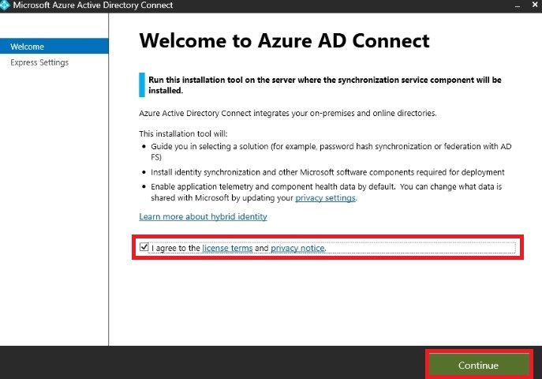
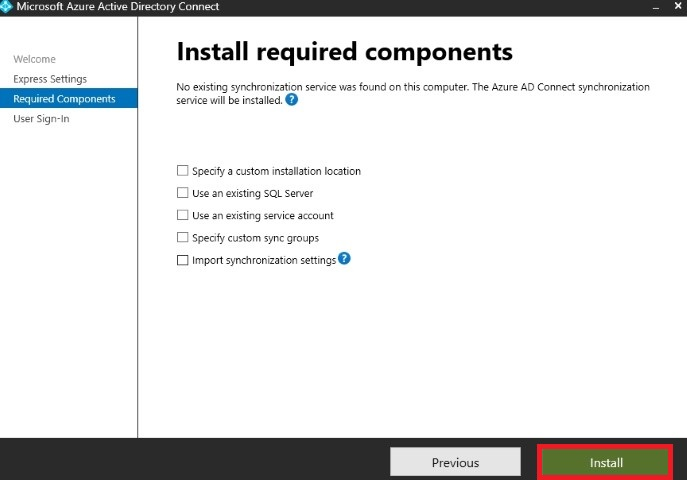
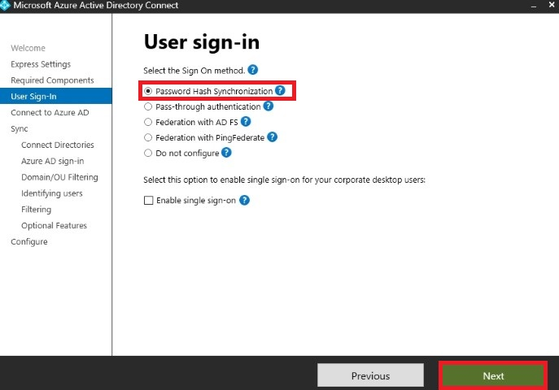
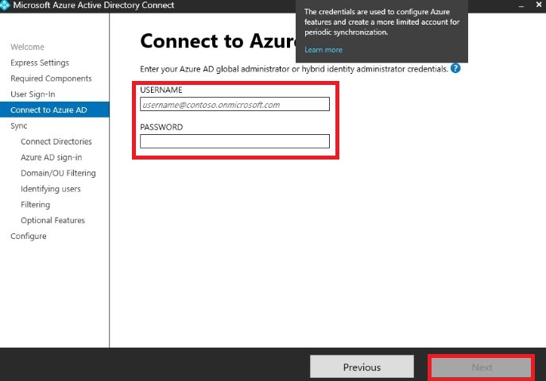
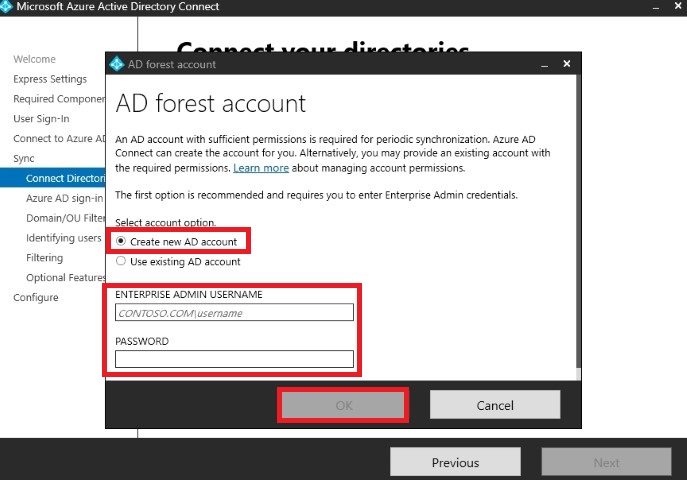
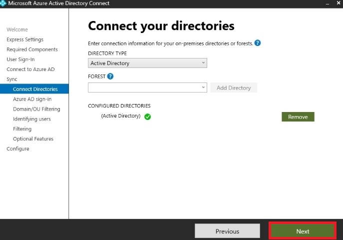
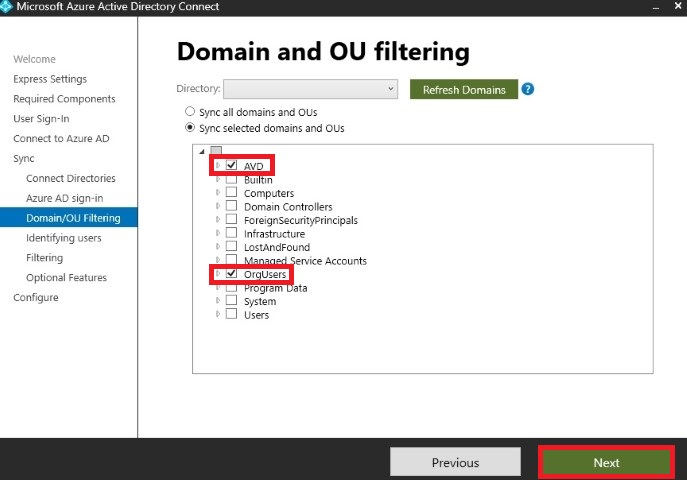
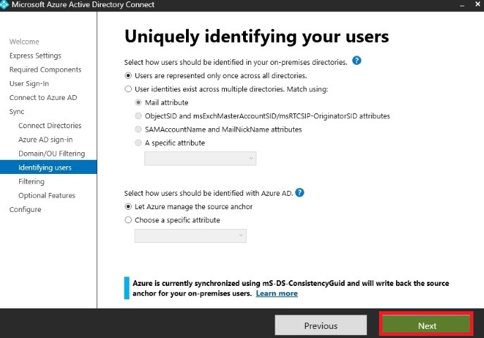
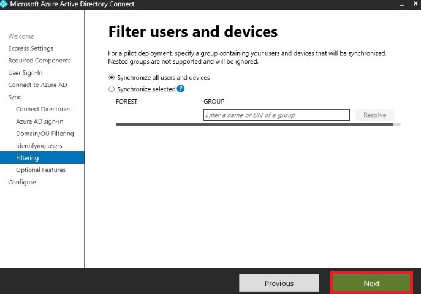
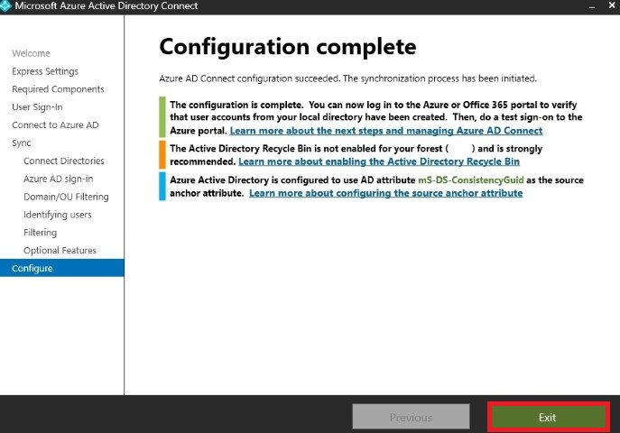

# Azure Active Directory Hybrid Lab - PowerShell version

- [Azure Active Directory Hybrid Lab - PowerShell version](#azure-active-directory-hybrid-lab---powershell-version)
  - [New-AAD-Hybrid-Lab.ps1: Step-by-step guide](#new-aad-hybrid-labps1-step-by-step-guide)
  - [New-AAD-Hybrid-BCDR-Lab.ps1](#new-aad-hybrid-bcdr-labps1)

The [New-AAD-Hybrid-Lab.ps1](https://github.com/lavanack/laurentvanacker.com/blob/master/Azure/Azure%20Virtual%20Desktop/AAD-Hybrid-Lab%20-%20PowerShell/New-AAD-Hybrid-Lab.ps1) has the same functionality same the lab available on [https://github.com/lavanack/laurentvanacker.com/tree/master/Azure/Azure%20Virtual%20Desktop/AAD-Hybrid-Lab](https://github.com/lavanack/laurentvanacker.com/tree/master/Azure/Azure%20Virtual%20Desktop/AAD-Hybrid-Lab) but in a full Powershell version  instead of using ARM templates.
The default values remain the same as the original version (ARM-based) with one exception: you can optionally deploy Azure Bastion (cf. parameters at the end of the [New-AAD-Hybrid-Lab.ps1](https://github.com/lavanack/laurentvanacker.com/blob/master/Azure/Azure%20Virtual%20Desktop/AAD-Hybrid-Lab%20-%20PowerShell/New-AAD-Hybrid-Lab.ps1) script). Feel free to customize the values to your needs.

## New-AAD-Hybrid-Lab.ps1: Step-by-step guide

- Open the [New-AAD-Hybrid-Lab.ps1](https://github.com/lavanack/laurentvanacker.com/blob/master/Azure/Azure%20Virtual%20Desktop/AAD-Hybrid-Lab%20-%20PowerShell/New-AAD-Hybrid-Lab.ps1) script and customize the parameters values (at the end of the file) to your needs.
- Run it
- You will be prompted for 2 credential sets:
  - Domain Administrator credentials (the username will be auto-filled with your current logged in username" but you can change it if you want)
  - Password (and ony password) for the 6 demo users

The deployment will take around 15 minutes to complete.

At the end of the deployment, proceed as follow:

- Connect via RDP (via the public IP address - a NSG rule allow a direct connection from your public IP - the one you use when deploying the Azure VM) or Azure Bastion
- Run Azure AD Connect (Shortcut on the desktop) and configure as follow:

  
  
  
  
  
  
  
  
  
  
  
  
  
  
  
- At the end, you will find the 6 demo users in the [Azure Portal](https://portal.azure.com/#view/Microsoft_AAD_UsersAndTenants/UserManagementMenuBlade/~/AllUsers).

## New-AAD-Hybrid-BCDR-Lab.ps1

The [New-AAD-Hybrid-BCDR-Lab.ps1](https://github.com/lavanack/laurentvanacker.com/blob/master/Azure/Azure%20Virtual%20Desktop/AAD-Hybrid-Lab%20-%20PowerShell/New-AAD-Hybrid-BCDR-Lab.ps1) is for BCDR strategy for the domain controller(s):

- An additional DC will deployed in an another Azure region - "eastus2" by default (customize the value to your needs).
- A vNet peering will be created between the two vNets (primary and secondary regions)
- You just will have to configure the AzureAD Connect in Staging Mode
