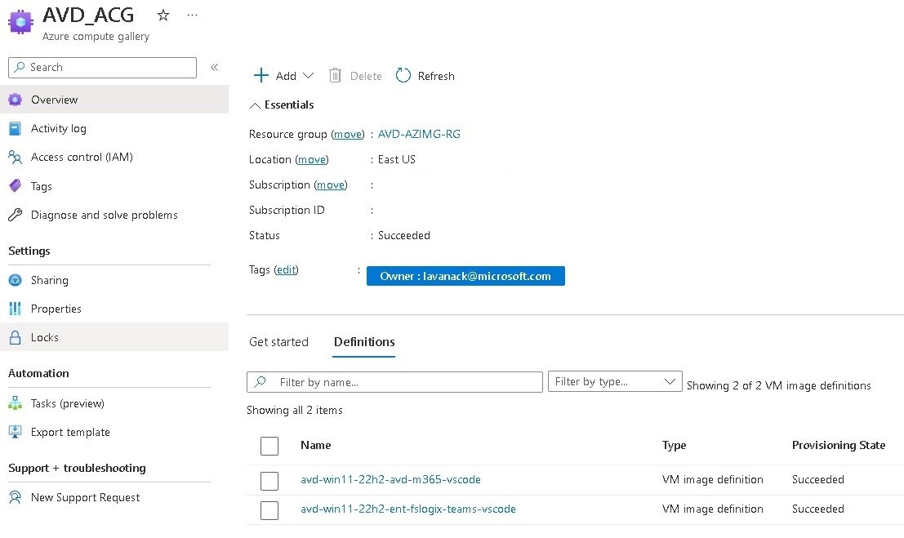

# Azure Image Builder

- [Azure Image Builder](#azure-image-builder)
  - [AzureImageBuilder.ps1](#azureimagebuilderps1)
    - [Prerequisites](#prerequisites)
    - [Setup](#setup)
  - [AzureImageBuilder-v2.ps1](#azureimagebuilder-v2ps1)
  - [AzureImageBuilder-v3.ps1](#azureimagebuilder-v3ps1)
  - [AzureImageBuilder-v4.ps1](#azureimagebuilder-v4ps1)
  - [AzureImageBuilder with CMK.ps1](#azureimagebuilder-with-cmkps1)

## AzureImageBuilder.ps1

The [AzureImageBuilder.ps1](AzureImageBuilder.ps1) script creates an [Azure Compute Gallery](https://learn.microsoft.com/en-us/azure/virtual-machines/azure-compute-gallery) with 2 image definitions as shown below:

### Prerequisites

- An [Azure](https://portal.azure.com) Subscription

### Setup

Run the [AzureImageBuilder.ps1](AzureImageBuilder.ps1) script (PowerShell 5.1 needed) wait for completion (~40 minutes).

**Notes:**

- The first image definition is based on the [armTemplateAVD.json](armTemplateAVD.json) file.
  - Will use the latest Windows 11 Enterprise 22H2 Multi-Session (without Microsoft 365) image from the Azure Marketplace
  - The Azure VM will use the [Standard_D4s_v5](https://learn.microsoft.com/en-us/azure/virtual-machines/dv5-dsv5-series#dsv5-serieshttps://learn.microsoft.com/en-us/azure/virtual-machines/dv3-dsv3-series) Azure VM (127GB for the disk space).
  - The OS will be optimized for [Azure Virtual Desktop](https://azure.microsoft.com/en-us/products/virtual-desktop). These optimisations come from the [RDS-Templates GitHub](https://github.com/Azure/RDS-Templates/tree/master/CustomImageTemplateScripts). These scripts are supported by the AVD Product Group. The [AVD Accelerator](https://github.com/Azure/avdaccelerator) scripts are maintained by the community/field and are not officially supported by Microsoft.
  - [Visual Studio Code](https://code.visualstudio.com/) will be installed
  - The Windows latest updates will be installed
  - The autoupdate feature will be disabled
  - The TimeZone Redirection feature will be enabled
- The second image is based on a market place image
  - Will use the latest Windows 11 Enterprise 22H2 with Microsoft 365 optimized [Azure Virtual Desktop](https://azure.microsoft.com/en-us/products/virtual-desktop) for image from the Azure Marketplace
  - All others settings are the same as the first image definition

## AzureImageBuilder-v2.ps1

The [AzureImageBuilder-v2.ps1](AzureImageBuilder-v2.ps1) script is almost the same than the previous one but adds the French and German language packs to the generated images (via ARM and PowerShell like the [AzureImageBuilder.ps1](AzureImageBuilder.ps1)).

## AzureImageBuilder-v3.ps1

The [AzureImageBuilder-v3.ps1](AzureImageBuilder-v3.ps1) script is an evolution of the [AzureImageBuilder-v2.ps1](AzureImageBuilder-v2.ps1)). It downloads Notepad++ installer and store it in an Azure Container. In additon a simple PowerShell script is also added in the same location to silently install Notepad++ on the VM during the image build. The Notepad++ installation occurs only in the PowerShell version (not in the ARM version) because I dynamically built the process with Powershell (Thinking to a V4 version).
In this version we use a win10-22h2-ent-g2 image from the Azure Marketplace (This was requested for a customer demo) and I have increased the build time out from 180 to 240 minutes. In addition, the VM size was switched from Standard_D4s_v5 to Standard_D8s_v5 to speed up the build process.

## AzureImageBuilder-v4.ps1

... In progress ...
Should use an existing Virtual Network and Subnet to build the VM.
More details [here](https://learn.microsoft.com/en-us/azure/virtual-machines/linux/image-builder-networking) and [here](https://learn.microsoft.com/en-us/azure/virtual-machines/windows/image-builder-vnet).

## AzureImageBuilder with CMK.ps1

The script [AzureImageBuilder with CMK.ps1](AzureImageBuilder%20with%20CMK.ps1) is an example to show how to use a customer-managed key to encrypt a VM Image Version. It was asked by a customer
