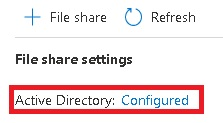

# FSLogix

Table of content:
- [FSLogix](#fslogix)
  - [Context](#context)
  - [Prerequisites](#prerequisites)

## Context
[FSLogix]([image.pngimage.png](https://learn.microsoft.com/en-us/fslogix/)) enhances and enables user profiles in Windows remote computing environments. FSLogix may also be used to create more portable computing sessions when using physical devices.

FSLogix includes:

* Profile Container
* Office Container
* Application Masking
* Java Version Control

See [FSLogix](https://docs.microsoft.com/en-us/fslogix/overview) for more information.

I use the [New-FSLogixAzFileShare.ps1](New-FSLogixAzFileShare.ps1) script to create a new Azure File Share for FSLogix. This script has to be run from the deployed Domain Controller.

## Prerequisites 

  *   An [Azure](https://portal.azure.com) Subscription
  *   A deployed [Azure Active Directory Hybrid Lab](https://github.com/PeterR-msft/M365AVDWS/tree/master/AAD-Hybrid-Lab) environment

**Notes:**
* Some variables needs to be adjusted to reflect your environment (around line 41)
  * $ADOUName: Organization Unit name where the AVD resources (Session Hosts ...) are currently stored
  * $UserOUName:  Organization Unit name where your AVD users (Bill Smith, Bob Jones ...) are currently stored
  * $AVDUsers: The Security Group name we will  create for storing all your AVD users (inside the $ADOUName OU)
  * $resourceGroupName: The name of the Resource Group where your storage account will be deployed
* The [New-FSLogixAzFileShare.ps1](New-FSLogixAzFileShare.ps1) script will proceed as follows
  * Create the $AVDUsers global security group and store all the users from the $UserOUName OU inside
  * Run a syncronization between Azure AD and the deployed Active Directory
  * Create a Storage Account in the $resourceGroupName Resource Group and configure the Active Directory related settings
  
  
  * The script will create two new Azure File Shares ('profiles' and 'odfc') and mount them as a local drive on the Domain Controller, set the right NTFS permissions and the right RBAC permissions
  * The shares are now ready to be used by the FSLogix Profile Container and Office Container
  * I use mainly this script as a sample when delivering the [Microsoft 365: Windows Virtual Desktop WorkshopPLUS](https://query.prod.cms.rt.microsoft.com/cms/api/am/binary/RE4u9dY)
  