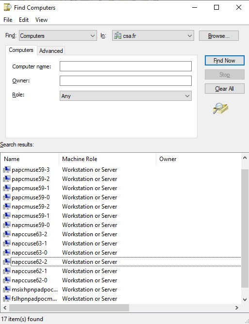

# Azure Virtual Desktop -Proof Of Concept - PowerShell version

- [Azure Virtual Desktop -Proof Of Concept - PowerShell version](#azure-virtual-desktop--proof-of-concept---powershell-version)
  - [Prerequisites](#prerequisites)
  - [What this script does ?](#what-this-script-does-)
  - [TL;DR](#tldr)
  - [Script Explanation](#script-explanation)
    - [Azure Key Vault for Credentials](#azure-key-vault-for-credentials)
    - [Azure Compute Gallery](#azure-compute-gallery)
  - [Deployment](#deployment)
  - [Remote Desktop Connection Manager](#remote-desktop-connection-manager)
  - [Testing](#testing)
  - [Technical Details](#technical-details)
    - [New-AzAvdHostPoolSetup](#new-azavdhostpoolsetup)
    - [New-AzAvdPooledHostPoolSetup](#new-azavdpooledhostpoolsetup)
    - [New-AzAvdPersonalHostPoolSetup](#new-azavdpersonalhostpoolsetup)
    - [Helpers functions](#helpers-functions)
      - [Intune](#intune)
      - [Others](#others)
    - [Deliverables](#deliverables)
    - [Limitations](#limitations)
    - [Azure Resources](#azure-resources)
    - [What's next ?](#whats-next-)

> [!IMPORTANT]
> The script [New-AzAvdHostPoolSetup.ps1](New-AzAvdHostPoolSetup.ps1) relies on the [PSAzureVirtualDesktop](https://www.powershellgallery.com/packages/PSAzureVirtualDesktop) PowerShell module I developed. It illustrates some capabilities of the [PSAzureVirtualDesktop](https://www.powershellgallery.com/packages/PSAzureVirtualDesktop). You can use it as-is, customize it to meet your needs or use it as an inspiration to build your own script(s).   
> 
> The [PSAzureVirtualDesktop](https://www.powershellgallery.com/packages/PSAzureVirtualDesktop) module is my take on an Azure Virtual Desktop (AVD) Proof Of Concept (POC). It's not designed for production use and comes with no guarantees. I created it during my learning phase with Azure Virtual Desktop (AVD), aiming to consolidate some best practices and to quicky run POCs. The script encompasses both OnPrem and Azure configurations in a single PowerShell script. 
> 
> All explanations are available on the [GitHub](https://github.com/lavanack/PSAzureVirtualDesktop) site.
> 
> **For a Microsoft-supported version deployment, I suggest using the Azure Virtual Desktop (AVD) Landing Zone Accelerator (LZA), which is available [here](https://github.com/Azure/avdaccelerator). Please note that this only covers the Azure component.**

>[!WARNING]
> The [PSAzureVirtualDesktop](https://www.powershellgallery.com/packages/PSAzureVirtualDesktop) module requires some other PowerShell modules (which are also automatically installed when you installs it) and you could receive this kind of error message when importing the module (via `Import-Module` or `#requires`)
> ```
> Import-Module : Function <...> cannot be created because function capacity 4096 has been exceeded for this scope
> ```
>
> You can simply fix by running the following PowerShell command line
> ``` powershell
> $Global:MaximumFunctionCount = 32768
> ```

## Prerequisites

Before proceeding, ensure that a domain controller is present in your Azure subscription. This requires a Windows Server with the Active Directory Directory Services role installed and configured. If this is not already set up, you can use the following links to create these resources. The options are listed from least to most preferred:

- [https://aka.ms/m365avdws](https://aka.ms/m365avdws)
- [https://github.com/lavanack/laurentvanacker.com/tree/master/Azure/Azure%20Virtual%20Desktop/AAD-Hybrid-Lab](https://github.com/lavanack/laurentvanacker.com/tree/master/Azure/Azure%20Virtual%20Desktop/AAD-Hybrid-Lab)
- [https://github.com/lavanack/laurentvanacker.com/tree/master/Azure/Azure%20Virtual%20Desktop/AAD-Hybrid-Lab%20-%20PowerShell](https://github.com/lavanack/laurentvanacker.com/tree/master/Azure/Azure%20Virtual%20Desktop/AAD-Hybrid-Lab%20-%20PowerShell) (Only the New-AAD-Hybrid-Lab.ps1: Step-by-step guide is needed - the rest is optional)

> [!IMPORTANT]
> The [New-AzAvdHostPoolSetup.ps1](New-AzAvdHostPoolSetup.ps1) script has to be executed from the Domain Controller (from any local folder) using an account with domain administrator privileges. An Azure privilege role (for example, Global Administrator) is also necessary to deploy the Azure resources.
>
> You can call it by specifying the `-AsJob` switch. When specified, the HostPools  will be deployed in parallel (via the [Start-ThreadJob](https://learn.microsoft.com/en-us/powershell/module/threadjob/start-threadjob?view=powershell-7.4&viewFallbackFrom=powershell-5.1) cmdlet) instead of sequentially. The processing time is greatly reduced from 4.5 hours to 1.5 hours (including the Azure Compute Gallery Setup if needed - without the Azure Compute Gallery Setup, the processing time are 3.5 hours sequentially  and 45 minutes in parallel) for the proposed HostPool configurations. Of course, the fewer configurations you define, the shorter the processing time will be (especially in sequential mode). 
> 
## What this script does ?

This script is designed to quickly deploy multiple full Azure Virtual Desktop environments, in minutes to hours. It adheres to Microsoft documentation and recommended practices.
Each time the script is run, a transcription with a timestamp will be created in the script directory.

## TL;DR

If you don't want to continue reading, here is the [TL;DR](https://dictionary.cambridge.org/dictionary/english/tldr) version:

- By default, this script will set up 8 HostPools (6 Pooled and 2 Personal). You can customize the HostPools that are deployed by altering the lines in the specified region:

```powershell:
#region Creating Host Pools
...
#endregion
```

More details [here](https://github.com/lavanack/PSAzureVirtualDesktop/wiki/HostPool-PowerShell-Classes#hostpool-powershell-class-base-class).

## Script Explanation

> [!WARNING]
> In July 2024, A bug was filled (more details [here](https://github.com/Azure/RDS-Templates/issues/793#issuecomment-2259928963)) about the failure of the Custom Image Template for AVD because of Windows Update. I commented the Azure Compute Gallery part due to this bug. I will uncomment it when the bug will be fixed.


### Azure Key Vault for Credentials

You probably noticed the [New-PsAvdHostPoolSessionHostCredentialKeyVault](https://github.com/lavanack/PSAzureVirtualDesktop/wiki/New-PsAvdHostPoolSessionHostCredentialKeyVault) function I called  in the [New-AzAvdHostPoolSetup.ps1](New-AzAvdHostPoolSetup.ps1) script. This function will create an Azure Key Vault where we will store credentials for the Session Hosts.
The credentials will be stored as secrets in the Azure Key Vault:

- `ADJoinUserName`: The user name for the account used to join the Session Hosts to the Active Directory domain
- `ADJoinPassword`: The password for the account used to join the Session Hosts to the Active Directory domain
- `LocalAdminUserName`: The user name for the local administrator account on the Session Hosts
- `LocalAdminPassword`: The password for the local administrator 

You can also use your own Azure Key Vault (with these 4 secret names) or let the script create one for you with the `New-AzHostPoolSessionCredentialKeyVault` function.
The [New-PsAvdHostPoolSessionHostCredentialKeyVault](https://github.com/lavanack/PSAzureVirtualDesktop/wiki/New-PsAvdHostPoolSessionHostCredentialKeyVault) waits for two optional PSCredential objects : 
- `LocalAdminCredential` 
- `ADJoinCredential`.

> [!NOTE]
> If you don't specify the `LocalAdminCredential` parameter when calling the [New-PsAvdHostPoolSessionHostCredentialKeyVault](https://github.com/lavanack/PSAzureVirtualDesktop/wiki/New-PsAvdHostPoolSessionHostCredentialKeyVault) function, the `LocalAdminUserName` will be automatically set to the `localadmin` value (as the sAMAccountName) and the `LocalAdminPassword` will be automatically set via the [New-RandomPassword](https://github.com/lavanack/PSAzureVirtualDesktop/wiki/New-RandomPassword) function. For `ADJoinCredential`: If you don't specify it, `adjoin` will be used as the sAMAccountName and the password will also be randomly generated (via the [New-RandomPassword](https://github.com/lavanack/PSAzureVirtualDesktop/wiki/New-RandomPassword) function).

> [!IMPORTANT]
> If you specify the `ADJoinCredential` parameter and the account doesn't exist in the Active Directory, it will be created later in the script processing (in the [Grant-ADJoinPermission](https://github.com/lavanack/PSAzureVirtualDesktop/wiki/Grant-PsAvdADJoinPermission) function). But if the account already exists in the Active Directory, you have to specify the current sAMAccountNAme and password for this account.


### Azure Compute Gallery

I also create an Azure Compute Gallery with the [New-AzureComputeGallery](https://github.com/lavanack/PSAzureVirtualDesktop/wiki/New-AzureComputeGallery) function. All details are [here](../Azure/Azure%20Virtual%20Desktop/Azure%20Image%20Builder#azureimagebuilderps1) (AzureImageBuilder.ps1 paragraph only - nevertheless you can read all the article to see  some posibilities an Azure Compute Gallery can offer). If you prefer to use your own Azure Compute Gallery images, you can comment the call to [New-AzureComputeGallery](https://github.com/lavanack/PSAzureVirtualDesktop/wiki/New-AzureComputeGallery) function and adjust the Azure Compute Gallery to use in the lines starting with:
  
  ```powershell
$AzureComputeGallery = Get-AzGallery ...
...
$GalleryImageDefinition = Get-AzGalleryImageDefinition -GalleryName ...
```

> [!NOTE]
> Each run will generate a new Azure Compute Gallery and increase the processing time by around  45 minutes. If you don't comment the call to the [New-AzureComputeGallery](https://github.com/lavanack/PSAzureVirtualDesktop/wiki/New-AzureComputeGallery) function.


## Deployment

The `New-AzAvdHostPoolSetup` function is the main function of the script. It takes an `$HostPool` array as parameter (so set the parameter values you want for the HostPool(s) you want to deploy). It will deploy all the resources needed for the HostPool(s) based on the `$HostPool` array. All information on configuring the HostPool(s) can be found [here](#hostpool-powershell-classes).

> [!NOTE]
> The impacted ressources by the parallel mode are only the HostPools. The Session Hosts are created in parallel (per Host Pool). The Job Management is done at the end of the `New-AzAvdHostPoolSetup` function.

> [!NOTE]
> Before calling the `New-AzAvdHostPoolSetup` function, The `$HostPool` array is stored as JSON in a HostPool_yyyyMMddHHmmss.json file in the script folder. You can reuse this file as a reminder of your previous HostPool(s) configurations or for removing the previously deployed Azure resources (via a call to the `Remove-AzAvdHostPoolSetup` function.).

> [!NOTE]
> Some Tags are added to every deployed AVD Host Pool with related information about the underlying configuration.

## Remote Desktop Connection Manager

At the end of the deployment an RDCMan (\<domain name\>.rdg) file generated on the Desktop will all information to connect to the deployed Azure VMs. You can use this file with the [Remote Desktop Connection Manager](https://download.sysinternals.com/files/RDCMan.zip) tool to connect to the Session Hosts. For the Azure AD/Microsoft Entra ID joined VM, the local admin credentials are stored in this file for an easier connection. For the AD Domain joined VM, the current logged in user is used. You just have to fill the password. Right click on the AVD section, go to the "Logon Credentials" tab, uncheck "Inherit from parent" and fill the password. It will be inherited at the lower levels.


## Testing

After a successful deployment, you can connect by using either [Remote Desktop Web Client](https://client.wvd.microsoft.com/arm/webclient/index.html), [Windows 365](https://windows365.microsoft.com/) or the [windows App](https://www.microsoft.com/store/productId/9N1F85V9T8BN?ocid=pdpshare) site and use one of the test users (available in `AVD Users` AD group in the `OrgUsers` OU).

## Technical Details

If you want to know more about the `New-AzAvdHostPooledPoolSetup`, `New-AzAvdHostPersonalPoolSetup` and `New-AzAvdHostPoolSetup` main functions, you can read the paragraph otherwise good test ;)

### New-AzAvdHostPoolSetup

This function serves as the backbone of the script and operates in the following manner:

- The required DNS forwarders are created in the Active Directory DNS (if not already present) for the Azure File Shared and the Azure Key Vaults.
- The `AVD` Organization Unit (OU) is created in the Active Directory domain (if not already present). A GPO is created and linked to this OU if Active Directory is configured as the identity provider. If EntraID is choosen, a dedicated Intune Configuration profile is created (The naming convention `[<HostPool Name>] AVD Policy` is used ). The following settings are configured:
  - Network Settings
  - Session Time Settings
  - Enabing [Screen Capture Protection](https://learn.microsoft.com/en-us/azure/virtual-desktop/screen-capture-protection)
  - Enabling [Watermarking](https://learn.microsoft.com/en-us/azure/virtual-desktop/watermarking)
  - Enabling and using the new [performance counters](https://learn.microsoft.com/en-us/training/modules/install-configure-apps-session-host/10-troubleshoot-application-issues-user-input-delay)
- The `AVD/PersonalDesktops` and `AVD/PooledDesktops` OUs are also created
- The following Starter GPOs `Group Policy Reporting Firewall Ports` and `Group Policy Remote Update Firewall Ports` are also created and linked to the `AVD` OU
- Two starter GPOs (`Group Policy Reporting Firewall Ports` and `Group Policy Reporting Firewall Ports`) are also imported.
- The `Desktop Virtualization Power On Off Contributor` role-based access control (RBAC) role is assigned to the Azure Virtual Desktop service principal with your Azure subscription as the assignable scope. More details [here](https://learn.microsoft.com/en-us/azure/virtual-desktop/start-virtual-machine-connect?tabs=azure-portal#assign-the-desktop-virtualization-power-on-contributor-role-with-the-azure-portal).
- Every HostPool is processed based on its type (more details [here](HostPoolClasses.md)) by calling either the `New-AzAvdPersonalHostPoolSetup` or the `New-AzAvdPooledHostPoolSetup` function (sequentially or via a parallel processing if the `-AsJob` switch is specified - but not recommended as explained above !).
- The same random number is used for the Index for the Personal and Pooled host pool index to minimize the risk of name collisions per Azure region.

### New-AzAvdPooledHostPoolSetup

This function is called by the `New-AzAvdHostPoolSetup` function for every HostPool of type Pooled. It proceeds as follows (not necessary in this order):

- A dedicated OU is created (if not already present) in the Active Directory domain (under the `AVD` OU) per Azure Region. The OU Name is the Azure region name (`EastUS` for instance).
- An other dedicated OU is created in the Active Directory domain (under the `AVD/<Azure Region>/PooledDesktops` OU) for the every Pooled HostPool. The OU name is the HostPool name.
- A Security Global AD Group is created with the naming convention `<HostPoolName> - Desktop Application Group Users` (all test users - via the `AVD Users` AD security Group - are added to the created groups at the end of the script) for the users authorized to use the Desktop Application Group.
- A Security Global AD Group is created with the naming convention `<HostPoolName> - Remote  Application Group Users` (all test users - via the `AVD Users` AD security Group - are added to the created groups at the end of the script) for the users authorized to use the Remote Application Group.
- A dedicated Azure Resource Group is created for the HostPool (the naming convention `rg-avd-<HostPoolName>` is used via the `GetResourceGroupName()` function of the `HostPool` Powershell Class as explained [here](HostPoolClasses.md))
- The ADJoin user (The related credentials are stored in the Azure Key Vault) is created if not already present and receives the required rights to add computer accounts to the Active Directory domain (via the `Grant-ADJoinPermission` function - more details [here](#azure-key-vault-for-credentials)).
- If FSLogix is required:
  - A FSLogix file share (called `profiles`) is created in a dedicated Storage Account (the naming convention `fsl<HostPoolName without dashes and in lowercase>` is used via the `GetFSLogixStorageAccountName()` function of the `PooledHostPool` Powershell Class) on the dedicated resource group, the [required NTFS permissions](https://learn.microsoft.com/en-us/fslogix/how-to-configure-storage-permissions#recommended-acls) are set. Depending of Identity Provider configured (AD vs. EntraID with or without Intune) some additional configuration settings are also enabled (via respectively GPO Settings, Registry Keys or Intune configuration profiles and platform scripts). The credentials for the storage account are stored in Windows Credential Manager. A [redirections.xml](https://learn.microsoft.com/fr-fr/fslogix/tutorial-redirections-xml) file is also created in the file share. If Entra ID is used as identity provider, the MFA is disabled for the Storage Account (via the `New-NoMFAUserEntraIDGroup` and `New-MFAForAllUsersConditionalAccessPolicy` functions and a dedicated `[AVD] Require multifactor authentication for all users` (defaut value) Conditional Access Policy and a `No-MFA Users` (default value) Entra ID group for the excluded users)
  
> [!NOTE]
> An `odfc` fileshare is also created for the Office Container but it is not used for the moment.
  
- A Private Endpoint is created for the Storage Account and the required DNS configuration is also created.
- If Active Directory is set as identity provider:
  - 3 dedicated AD security groups are created and the required role assignments are done
    - `<HostPoolName> - FSLogix Contributor` (`Storage File Data SMB Share Contributor` role assignment on the Azure File Share): This AD group will contain the end-users that will have a FSLogix Profile Container (all test users - via the `AVD Users` AD security Group).
    - `<HostPoolName> - FSLogix Elevated Contributor` (`Storage File Data SMB Share Elevated Contributor` role assignment on the Azure File Share)
    - `<HostPoolName> - FSLogix Reader` (`Storage File Data SMB Share Reader` role assignment on the Azure File Share)
  - A GPO is also created (name: `<HostPoolName> - FSLogix Settings`) with some settings for:
    - [Profile Container](https://learn.microsoft.com/en-us/fslogix/tutorial-configure-profile-containers#profile-container-configuration)
    - [Timezone redirection](https://learn.microsoft.com/en-us/azure/virtual-desktop/set-up-customize-master-image#set-up-time-zone-redirection)
    - [Disabling automatic updates](https://learn.microsoft.com/en-us/azure/virtual-desktop/set-up-customize-master-image#disable-automatic-updates)
    - [Disabling Storage Sense](https://learn.microsoft.com/en-us/azure/virtual-desktop/set-up-customize-master-image#disable-storage-sense)
    - [Setting antivirus exclusions](https://learn.microsoft.com/en-us/fslogix/overview-prerequisites#configure-antivirus-file-and-folder-exclusions)
    - A FSLogix Profile Container exclusion is set for the `Domain Admins` AD group
- If Entra ID is set as identity provider, the above settings are managed via a dedicated Intune configuration profile (The naming convention `[<HostPool Name>] AVD Policy` is used)
- If MSIX is required (only supported with Active Directory as Identity Provider):
  - A MSIX file share (called `msix`) is created in a dedicated Storage Account (the naming convention `msix<HostPoolName without dashes and in lowercase>`) on the dedicated resource group, the [required NTFS permissions](https://learn.microsoft.com/en-us/azure/virtual-desktop/app-attach-overview?pivots=msix-app-attach#permissions) are set and the account is registered in the Active Directory Domain. The credentials for the storage account are stored in Windows Credential Manager.
  - A Private Endpoint is created for the Storage Account and the required DNS configuration is also created.
  - 3 dedicated AD security groups are created and the required role assignments are done
    - `<HostPoolName> - MSIX Hosts` (`Storage File Data SMB Share Contributor` role assignment on the Azure File Share). This AD group will contain the Session Hosts that will have a MSIX App Attach.
    - `<HostPoolName> - MSIX Share Admins` (`Storage File Data SMB Share Elevated Contributor` role assignment on the Azure File Share)
    - `<HostPoolName> - MSIX Users` (`Storage File Data SMB Share Contributor` role assignment on the Azure File Share). This AD group will contain the end users that will have use MSIX App Attach (all test users - via the `AVD Users` AD security Group).
  - A GPO is also created (name: `<HostPoolName> - MSIX Settings`) with some settings for:
    - [Turning off automatic updates for MSIX app attach applications](https://learn.microsoft.com/en-us/azure/virtual-desktop/app-attach-azure-portal#turn-off-automatic-updates-for-msix-app-attach-applications)
    - [Setting antivirus exclusions](https://learn.microsoft.com/en-us/fslogix/overview-prerequisites#configure-antivirus-file-and-folder-exclusions)
  - Some demo applications (and related certificate) are also deployed  from [here](https://github.com/lavanack/laurentvanacker.com/tree/master/Azure/Azure%20Virtual%20Desktop/MSIX/MSIX)
- An Azure Key Vault is also created (with the naming convention `kv-<HostPoolName without dashes and in lowercase>` via the `GetKeyVaultName()` function of the `$HostPool` PowerShell class) on the dedicated resource group. This KeyVault is secured via a Private Endpoint and the required DNS configuration is also created. This KeyVault is deployed for testing purpose only and is not used for the moment.
- A Pooled Hostpool is also created.
- A Desktop Application Group is also created (with the naming convention `<HostPoolName>- DAG`) and the `Desktop Virtualization User` RBAC role is assigned to the `<HostPoolName> - Desktop Application Group Users` AD security group.
- A Remote Application Group is also created (with the naming convention `<HostPoolName>- RAG`) and the `Desktop Virtualization User` RBAC role is assigned to the `<HostPoolName> - Desktop Application Group Users` AD security group. Two random applications from the Start Menu are added to this Aplication Group.
- A Workspace is also created (with the naming convention `ws-<HostPoolName>` via the `GetAzAvdWorkSpaceName()` function of the `$HostPool` PowerShell class)
- The Session Hosts are added to the HostPool and are either AD Domain joined or EntraID joined (depending of the identity provider configured). If Entra ID is the used identity provider a dynamic group is created with the following naming convention :  `<HostPoolName> - Devices`
- A Log Analytics Workspace is also deployed (with the naming convention `log-<HostPoolName>`via the `GetLogAnalyticsWorkSpaceName()` function of the `$HostPool` PowerShell class) and the Session Hosts are connected to it. More details can be found [here](https://learn.microsoft.com/en-us/training/modules/monitor-manage-performance-health/3-log-analytics-workspace-for-azure-monitor) and [here](https://www.rozemuller.com/deploy-azure-monitor-for-windows-virtual-desktop-automated/#update-25-03-2021).
- The [Azure Monitor Agent](https://learn.microsoft.com/en-us/azure/azure-monitor/agents/agents-overview) is also installed on the Session Hosts and the configured event logs and performance counters are collected via a dedicated [Data Collection Rule](https://learn.microsoft.com/en-us/azure/azure-monitor/essentials/data-collection-rule-overview?tabs=portal).

### New-AzAvdPersonalHostPoolSetup

This function is called by the `New-AzAvdHostPoolSetup` function for every HostPool of type Personal. It proceeds as follows (not necessary in this order):

- A dedicated OU is created (if not already present) in the Active Directory domain (under the `AVD` OU) per Azure Region. The OU Name is the Azure region name (`EastUS` for instance).
- An other dedicated OU is created in the Active Directory domain (under the `AVD/<Azure Region>/PersonalDesktops` OU) for the every Personal HostPool. The OU name is the HostPool name.
- A Security Global AD Group is created with the naming convention `<HostPoolName> - Desktop Application Group Users` (all test users - via the `AVD Users` AD security Group - are added to the created groups at the end of the script) for the users authorized to use the Desktop Application Group.
- A dedicated Azure Resource Group is created for the HostPool (the naming convention `rg-avd-<HostPoolName>` is used via the `GetResourceGroupName()` function of the `HostPool` Powershell Class as explained [here](HostPoolClasses.md))
- The ADJoin user (The related credentials are stored in the Azure Key Vault) is created if not already present and receives the required rights to add computer accounts to the Active Directory domain (via the `Grant-ADJoinPermission` function - more details [here](#azure-key-vault-for-credentials)).
- An Azure Key Vault is also created (with the naming convention `kv-<HostPoolName without dashes and in lowercase>` via the `GetKeyVaultName()` function of the `$HostPool` PowerShell class) on the dedicated resource group. This KeyVault is secured via a Private Endpoint and the required DNS configuration is also created. This KeyVault is deployed for testing purpose only and is not used for the moment.
- A Pooled Hostpool is also created (with `BreadthFirst` load balancer type)
- A Desktop Application Group is also created (with the naming convention `<HostPoolName>- DAG`) and the `Desktop Virtualization User` RBAC role is assigned to the `<HostPoolName> - Desktop Application Group Users` AD security group.
- A Workspace is also created (with the naming convention `ws-<HostPoolName>` via the `GetAzAvdWorkSpaceName()` function of the `$HostPool` PowerShell class)
- The Session Hosts are added to the HostPool and are either AD Domain joined or EntraID joined (depending of the identity provider configured). If Entra ID is the used identity provider a dynamic group is created with the following naming convention :  `<HostPoolName> - Devices`
- A Log Analytics Workspace is also deployed (with the naming convention `log-<HostPoolName>`via the `GetLogAnalyticsWorkSpaceName()` function of the `$HostPool` PowerShell class) and the Session Hosts are connected to it. More details can be found [here](https://learn.microsoft.com/en-us/training/modules/monitor-manage-performance-health/3-log-analytics-workspace-for-azure-monitor) and [here](https://www.rozemuller.com/deploy-azure-monitor-for-windows-virtual-desktop-automated/#update-25-03-2021).
- The [Azure Monitor Agent](https://learn.microsoft.com/en-us/azure/azure-monitor/agents/agents-overview) is also installed on the Session Hosts and the configured event logs and performance counters are collected via a dedicated [Data Collection Rule](https://learn.microsoft.com/en-us/azure/azure-monitor/essentials/data-collection-rule-overview?tabs=portal).

### Helpers functions

Some helper functions are also available in the script and are documented here :

#### Intune

- MFA Conditional Access Policies
  - `New-NoMFAUserEntraIDGroup`: Creates an EntraID used later in the code for excluding some identities from the MFA Conditional Access Policy
  - `New-MFAForAllUsersConditionalAccessPolicy`: Creates a new MFA Conditional Access Policy and allows to exclude a dedicated group.
- Graph API
  - HTTP Call (Beta version - via a Graph HTTP request.)
    - `Get-MgGraphObject`: (not used): Returns all Graph objects.
    - `Remove-IntuneItemViaGraphAPI`: Remove some Intune objects.
    - `New-IntunePowerShellScriptViaGraphAPI`: Assigns a PowerShell script to some EntraID devices (via a dedicated group)
    - `Get-GroupPolicyDefinitionPresentationViaGraphAPI`: Returns a Group Policy Definition Presentation
    - `Import-FSLogixADMXViaGraphAPI`: Imports an ADMX (and the related ADML file) to Intune (used for importing the <https://aka.ms/fslogix-latest> files)
    - `Set-GroupPolicyDefinitionSettingViaGraphAPI`: Sets Group Policy definition settings
    - `New-FSLogixIntuneConfigurationProfileViaGraphAPI`: Creates an Intune Configuration profile for FSlogix
    - `New-AzAvdIntuneConfigurationProfileViaGraphAPI`: Creates an Intune Configuration profile for AVD
  - PowerShell cmdlets (Beta version): Same functions as the ones above but using the Microsoft.Graph.Beta modules and the related Get-MgBeta* cmdlets instead of calling directly the Graph API.
    - `Remove-IntuneItemViaCmdlet`
    - `New-IntunePowerShellScriptViaCmdlet`
    - `Get-GroupPolicyDefinitionPresentationViaCmdlet`
    - `Import-FSLogixADMXViaCmdlet`
    - `Set-GroupPolicyDefinitionSettingViaCmdlet`
    - `New-FSLogixIntuneConfigurationProfileViaCmdlet`
    - `New-AzAvdIntuneConfigurationProfileViaCmdlet`

#### Others

- `Set-AdminConsent`:
- `Test-AzAvdStorageAccountNameAvailability`: Grants admin consent to an Azure AAD app in Powershell?
- `Test-AzAvdKeyVaultNameAvailability`: Tests if the Key Vault name is available in Azure.
- `New-AzHostPoolSessionCredentialKeyVault`: Create the Azure Key Vault for the Session Hosts credentials
- `New-RandomPassword`: Generates a random password (used for the `localadmin` user password)
- `Get-AzKeyVaultNameAvailability`: coded as an alterative to the  `Test-AzKeyVaultNameAvailability` cmdlet (for testing purpose - no more used in this script)
- `Expand-AzAvdMSIXImage`: coded as an alterative to the  `Expand-AzWvdMsixImage` cmdlet (for testing purpose - no more used in this script)
- `Grant-ADJoinPermission`: Grants the required permissions to the ADJoin user
- [New-AzureComputeGallery](https://github.com/lavanack/PSAzureVirtualDesktop/wiki/New-AzureComputeGallery): Creates an Azure Compute Gallery with two images (more details [here](../Azure/Azure%20Virtual%20Desktop/Azure%20Image%20Builder#azureimagebuilderps1))
- `Get-AzVMCompute`: Gets The Azure VM Compute Object for the VM executing this function
- `New-AzAvdSessionHost`: Creates a Session Host
- `Add-AzAvdSessionHost`: Adds a Session Host to a HostPool
- `Copy-MSIXDemoAppAttachPackage`: Copy some MSIX artifacts (Notepad++) from my [GitHub](https://github.com/lavanack/laurentvanacker.com/tree/master/Azure/Azure%20Virtual%20Desktop/MSIX) to the dedicated storage account.
- `Copy-MSIXDemoPFXFile`: Copied the PFX file from my [GitHub](https://github.com/lavanack/laurentvanacker.com/tree/master/Azure/Azure%20Virtual%20Desktop/MSIX) to the session hosts.
- `Wait-PSSession`: Waits for a PowerShell session to be available on the specified hosts (via the [New-PSSession](https://learn.microsoft.com/en-us/powershell/module/microsoft.powershell.core/new-pssession) cmdlet)
- `Wait-AzVMPowerShell`: Waits for a session is ready for a Powershell Session (via the [Invoke-AzVMRunCommand](https://learn.microsoft.com/en-us/powershell/module/az.compute/invoke-azvmruncommand) cmdlet).
- `Start-MicrosoftEntraIDConnectSync`: Runs an Entra ID synchronization
- `Remove-AzAvdHostPoolSetup`: Removes the AVD environment (more details [here](#cleanup))
- `New-AzAvdPersonalHostPoolSetup`: Creates a new Personal Host Pool.
- `New-AzAvdPooledHostPoolSetup`: Creates a new Pooled Host Pool.
- `New-AzAvdHostPoolSetup`: Creates a new Host Pool (by calling one of the above functions).
- `New-AzAvdRdcMan`: Creates a RDG file on the Desktop with all the information to connect to the Session Hosts.
- `New-AzAvdRdcManV2`: Also creates a RDG file on the Desktop with all the information to connect to the Session Hosts.
- `New-AzAvdScalingPlan`: Creates a new Scaling Plan for the Host Pools.

### Deliverables

At the end of the deployment, the following deliverables are available (the following screenshots reflect the default values):

- A timestamped transcript file in the script directory
- A timestamped JSON file `HostPool_yyyyMMddHHmmss.json` in the script directory as a reminder of the deployed HostPool(s) configuration
- A .rdg file on the Desktop with all the information to connect to the Session Hosts (cf. [here](#remote-desktop-connection-manager))
- A dedicated Organization Unit (OU) in the Active Directory domain for every HostPool


- Some GPOs
  - 'AVD Global Settings' GPO linked to the `AVD` OU
  - '`<HostPoolName>` - FSLogix Settings' GPO linked to the `<HostPoolName>` OU for the FSLogix Settings (if FSLogix is required) per HostPool
  - '`<HostPoolName>` - MSIX Settings' GPO linked to the `<HostPoolName>` OU for the MSIX Settings (if MSIX is required) per HostPool
  - 2 starter GPOs linked to the `AVD` OU
    - 'Group Policy Reporting Firewall Ports'
    - 'Group Policy Remote Update Firewall Ports'


- Different HostPools (based on the HostPool type you setup)


- Some Azure AD/Microsoft Entra ID Devices
  


- Some AD Computers Objects
  


- Intune
  - Devices
  
  - Configuration Profiles
  
  - Platform Scripts
  

- Workspaces


### Limitations

- We will use the Virtual Network used for the Domain Controller. It is not recommended to use the same Virtual Network for the Domain Controller and the Session Hosts. It is recommended to use a dedicated Virtual Network for the Session Hosts. This is not implemented in the script for the moment.
- I'm not using Application Security Group (only Network Security Groups).
- FSLogix and MSIX features are only available for Pooled HostPools

### Azure Resources

The script will deploy the following Azure resources (ordered by alphabetical order):

- Azure Compute Gallery
  - Image Definition
  - Image Version
- Azure File Share (for FSLogix and MSIX)
- Azure Key Vault
- Azure Private Endpoint (for Azure File Share and Azure Key Vault)
- Azure Resource Group
- Azure Private DNS Zone (for Azure File Share and Azure Key Vault)
  - Virtual Network Link
- Azure Storage Account
- Azure Virtual Desktop
  - Host Pools
  - Application Groups
  - Workspaces
  - Session Hosts (Azure Virtual Machines, Azure Disk, Azure Network Interface, Azure Virtual Machine Extension)
  - Scaling Plans
- Data Collection Rules
- EntraID Conditional Access Policies
- EntraID Dynamic Groups
- EntraID Security Groups
- Intune
  - Devices
  - Intune Configuration Profiles
  - Intune Platform Scripts
- Log Analytics Workspace

### What's next ?

I will probably integrate the following features in the script (when time permits and not necessarily in this order):

- BCDR strategy for the AVD environment. A BCDR strategy is already scripted [here](https://github.com/lavanack/laurentvanacker.com/blob/master/Azure/Azure%20Virtual%20Desktop/AAD-Hybrid-Lab%20-%20PowerShell/New-AAD-Hybrid-BCDR-Lab.ps1) for the Domain Controller.
- Implementing the FSLogix [Cloud Cache](https://learn.microsoft.com/en-us/fslogix/tutorial-cloud-cache-containers) feature
- Hybrid Joined AVD Session Hosts
- [Use Azure Private Link to connect networks to Azure Monitor](https://learn.microsoft.com/en-us/azure/azure-monitor/logs/private-link-security)
- Write a PowerShell 7+ version of the script (I'm using PowerShell 5.1 for the moment)
- Implementing App Attach V2
