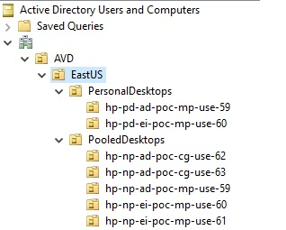
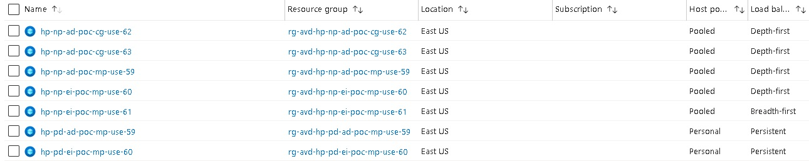

# Azure Virtual Desktop -Proof Of Concept - PowerShell version

- [Azure Virtual Desktop -Proof Of Concept - PowerShell version](#azure-virtual-desktop--proof-of-concept---powershell-version)
  - [Prerequisites](#prerequisites)
  - [What this script does ?](#what-this-script-does-)
  - [TL;DR](#tldr)
  - [Script Explanation](#script-explanation)
    - [Azure Key Vault for Credentials](#azure-key-vault-for-credentials)
    - [Azure Compute Gallery](#azure-compute-gallery)
  - [Deployment](#deployment)
  - [Remote Desktop Connection Manager](#remote-desktop-connection-manager)
  - [Testing](#testing)
  - [Technical Details](#technical-details)
    - [Deliverables](#deliverables)
    - [Limitations](#limitations)
    - [Azure Resources](#azure-resources)
    - [What's next ?](#whats-next-)

> [!IMPORTANT]
> The script [New-AzAvdHostPoolSetup.ps1](New-AzAvdHostPoolSetup.ps1) relies on the [PSAzureVirtualDesktop](https://www.powershellgallery.com/packages/PSAzureVirtualDesktop) PowerShell module I developed. It illustrates some capabilities of the [PSAzureVirtualDesktop](https://www.powershellgallery.com/packages/PSAzureVirtualDesktop). You can use it as-is, customize it to meet your needs or use it as an inspiration to build your own script(s).   
> 
> The [PSAzureVirtualDesktop](https://www.powershellgallery.com/packages/PSAzureVirtualDesktop) module is my take on an Azure Virtual Desktop (AVD) Proof Of Concept (POC). It's not designed for production use and comes with no guarantees. I created it during my learning phase with Azure Virtual Desktop (AVD), aiming to consolidate some best practices and to quicky run POCs. The script encompasses both OnPrem and Azure configurations in a single PowerShell script. 
> 
> All explanations are available on the [GitHub](https://github.com/lavanack/PSAzureVirtualDesktop) site.
> 
> **For a Microsoft-supported version deployment, I suggest using the Azure Virtual Desktop (AVD) Landing Zone Accelerator (LZA), which is available [here](https://github.com/Azure/avdaccelerator). Please note that this only covers the Azure component.**

>[!WARNING]
> The [PSAzureVirtualDesktop](https://www.powershellgallery.com/packages/PSAzureVirtualDesktop) module requires some other PowerShell modules (which are also automatically installed when you installs it) and you could receive this kind of error message when importing the module (via `Import-Module` or `#requires`)
> ```
> Import-Module : Function <...> cannot be created because function capacity 4096 has been exceeded for this scope
> ```
>
> You can simply fix by running the following PowerShell command line
> ``` powershell
> $Global:MaximumFunctionCount = 32768
> ```

## Prerequisites

Before proceeding, ensure that a domain controller is present in your Azure subscription. This requires a Windows Server with the Active Directory Directory Services role installed and configured. If this is not already set up, you can use the following links to create these resources. The options are listed from least to most preferred:

- [https://aka.ms/m365avdws](https://aka.ms/m365avdws)
- [https://github.com/lavanack/laurentvanacker.com/tree/master/Azure/Azure%20Virtual%20Desktop/AAD-Hybrid-Lab](https://github.com/lavanack/laurentvanacker.com/tree/master/Azure/Azure%20Virtual%20Desktop/AAD-Hybrid-Lab)
- [https://github.com/lavanack/laurentvanacker.com/tree/master/Azure/Azure%20Virtual%20Desktop/AAD-Hybrid-Lab%20-%20PowerShell](https://github.com/lavanack/laurentvanacker.com/tree/master/Azure/Azure%20Virtual%20Desktop/AAD-Hybrid-Lab%20-%20PowerShell) (Only the New-AAD-Hybrid-Lab.ps1: Step-by-step guide is needed - the rest is optional)

> [!IMPORTANT]
> The [New-AzAvdHostPoolSetup.ps1](New-AzAvdHostPoolSetup.ps1) script has to be executed from the Domain Controller (from any local folder) using an account with domain administrator privileges. An Azure privilege role (for example, Global Administrator) is also necessary to deploy the Azure resources.
>
> You can call it by specifying the `-AsJob` switch. When specified, the HostPools  will be deployed in parallel (via the [Start-ThreadJob](https://learn.microsoft.com/en-us/powershell/module/threadjob/start-threadjob?view=powershell-7.4&viewFallbackFrom=powershell-5.1) cmdlet) instead of sequentially. The processing time is greatly reduced from 4.5 hours to 1.5 hours (including the Azure Compute Gallery Setup if needed - without the Azure Compute Gallery Setup, the processing time are 3.5 hours sequentially  and 45 minutes in parallel) for the proposed HostPool configurations. Of course, the fewer configurations you define, the shorter the processing time will be (especially in sequential mode). 
> 
## What this script does ?

This script is designed to quickly deploy multiple full Azure Virtual Desktop environments, in minutes to hours. It adheres to Microsoft documentation and recommended practices.
Each time the script is run, a transcription with a timestamp will be created in the script directory.

## TL;DR

If you don't want to continue reading, here is the [TL;DR](https://dictionary.cambridge.org/dictionary/english/tldr) version:

- By default, this script will set up 8 HostPools (6 Pooled and 2 Personal). You can customize the HostPools that are deployed by altering the lines in the specified region:

```powershell:
#region Creating Host Pools
...
#endregion
```

More details [here](https://github.com/lavanack/PSAzureVirtualDesktop/wiki/HostPool-PowerShell-Classes#hostpool-powershell-class-base-class).

## Script Explanation

### Azure Key Vault for Credentials

You probably noticed the [New-PsAvdHostPoolSessionHostCredentialKeyVault](https://github.com/lavanack/PSAzureVirtualDesktop/wiki/New-PsAvdHostPoolSessionHostCredentialKeyVault) function I called  in the [New-AzAvdHostPoolSetup.ps1](New-AzAvdHostPoolSetup.ps1) script. This function will create an Azure Key Vault where we will store credentials for the Session Hosts.
The credentials will be stored as secrets in the Azure Key Vault:

- `ADJoinUserName`: The user name for the account used to join the Session Hosts to the Active Directory domain
- `ADJoinPassword`: The password for the account used to join the Session Hosts to the Active Directory domain
- `LocalAdminUserName`: The user name for the local administrator account on the Session Hosts
- `LocalAdminPassword`: The password for the local administrator 

You can also use your own Azure Key Vault (with these 4 secret names) or let the script create one for you with the `New-AzHostPoolSessionCredentialKeyVault` function.
The [New-PsAvdHostPoolSessionHostCredentialKeyVault](https://github.com/lavanack/PSAzureVirtualDesktop/wiki/New-PsAvdHostPoolSessionHostCredentialKeyVault) waits for two optional PSCredential objects : 
- `LocalAdminCredential` 
- `ADJoinCredential`.

> [!NOTE]
> If you don't specify the `LocalAdminCredential` parameter when calling the [New-PsAvdHostPoolSessionHostCredentialKeyVault](https://github.com/lavanack/PSAzureVirtualDesktop/wiki/New-PsAvdHostPoolSessionHostCredentialKeyVault) function, the `LocalAdminUserName` will be automatically set to the `localadmin` value (as the sAMAccountName) and the `LocalAdminPassword` will be automatically set via the [New-RandomPassword](https://github.com/lavanack/PSAzureVirtualDesktop/wiki/New-RandomPassword) function. For `ADJoinCredential`: If you don't specify it, `adjoin` will be used as the sAMAccountName and the password will also be randomly generated (via the [New-RandomPassword](https://github.com/lavanack/PSAzureVirtualDesktop/wiki/New-RandomPassword) function).

> [!IMPORTANT]
> If the `ADJoinCredential` account doesn't exist in the Active Directory, it will be created later in the script processing (in the [Grant-ADJoinPermission](https://github.com/lavanack/PSAzureVirtualDesktop/wiki/Grant-PsAvdADJoinPermission) function). But if the account already exists in the Active Directory, you have to specify the current sAMAccountNAme and password for this account.


### Azure Compute Gallery

I also create an Azure Compute Gallery with the [New-AzureComputeGallery](https://github.com/lavanack/PSAzureVirtualDesktop/wiki/New-AzureComputeGallery) function. All details are [here](../Azure%20Image%20Builder#azureimagebuilderps1) (AzureImageBuilder.ps1 paragraph only - nevertheless you can read all the article to see  some posibilities an Azure Compute Gallery can offer). If you prefer to use your own Azure Compute Gallery images, you can comment the call to [New-AzureComputeGallery](https://github.com/lavanack/PSAzureVirtualDesktop/wiki/New-AzureComputeGallery) function and adjust the Azure Compute Gallery to use in the lines starting with:
  
  ```powershell
$AzureComputeGallery = Get-AzGallery ...
...
$GalleryImageDefinition = Get-AzGalleryImageDefinition -GalleryName ...
```

> [!NOTE]
> Each run will generate a new Azure Compute Gallery and increase the processing time by around  45 minutes if you don't comment the call to the [New-AzureComputeGallery](https://github.com/lavanack/PSAzureVirtualDesktop/wiki/New-AzureComputeGallery) function.


> [!WARNING]
> In July 2024, A bug was filled (more details [here](https://github.com/Azure/RDS-Templates/issues/793#issuecomment-2259928963)) about the failure of the Custom Image Template for AVD because of Windows Update. I commented the Azure Compute Gallery part due to this bug. I will uncomment it when the bug will be fixed.

## Deployment

The [New-AzAvdHostPoolSetup](https://github.com/lavanack/PSAzureVirtualDesktop/wiki/New-PsAvdHostPoolSetup) function is the main function of the script. It takes an `$HostPool` array as parameter (so set the parameter values you want for the HostPool(s) you want to deploy). It will deploy all the resources needed for the HostPool(s) based on the `$HostPool` array. All information on configuring the HostPool(s) can be found [here](https://github.com/lavanack/PSAzureVirtualDesktop/wiki/HostPool-PowerShell-Classes).

> [!NOTE]
> The impacted ressources by the parallel mode are only the HostPools. The Session Hosts are created in parallel (per Host Pool). The Job Management is done at the end of the [New-AzAvdHostPoolSetup](https://github.com/lavanack/PSAzureVirtualDesktop/wiki/New-PsAvdHostPoolSetup)  function.

> [!NOTE]
> Before calling the [New-AzAvdHostPoolSetup](https://github.com/lavanack/PSAzureVirtualDesktop/wiki/New-PsAvdHostPoolSetup)  function, The `$HostPool` array is stored as JSON in a `HostPool_yyyyMMddHHmmss.json` file in the dedicated `Backup` subfolder in the script directory. You can reuse this file as a reminder of your previous HostPool(s) configurations or for removing the previously deployed Azure resources (via a call to the [Remove-AzAvdHostPoolSetup](https://github.com/lavanack/PSAzureVirtualDesktop/wiki/Remove-PsAvdHostPoolSetup)  function.).

> [!NOTE]
> Some Tags are added to every deployed AVD Host Pool with related information about the underlying configuration.

## Remote Desktop Connection Manager

At the end of the deployment an RDCMan file (named \<domain name\>.rdg) generated on the Desktop with all information to connect to the deployed Azure VMs. You can use this file with the [Remote Desktop Connection Manager](https://download.sysinternals.com/files/RDCMan.zip) tool to connect to the Session Hosts. For the Azure AD/Microsoft Entra ID joined VM, the local admin credentials are stored in this file for an easier connection. For the AD Domain joined VM, the current logged in user is used. You just have to fill the password. Right click on the AVD section, go to the "Logon Credentials" tab, uncheck "Inherit from parent" and fill the password. It will be inherited at the lower levels.


## Testing

After a successful deployment, you can connect by using either [Remote Desktop Web Client](https://client.wvd.microsoft.com/arm/webclient/index.html), [Windows 365](https://windows365.microsoft.com/) or the [Windows App](https://www.microsoft.com/store/productId/9N1F85V9T8BN?ocid=pdpshare) site and use one of the test users (available in `AVD Users` AD group in the `OrgUsers` OU).

## Technical Details


If you want to know more about the [New-PsAzAvdHostPooledPoolSetup](https://github.com/lavanack/PSAzureVirtualDesktop/wiki/New-PsAzAvdHostPooledPoolSetup), [New-PsAzAvdHostPersonalPoolSetup](https://github.com/lavanack/PSAzureVirtualDesktop/wiki/New-PsAvdPersonalHostPoolSetup) and [New-PsAzAvdHostPoolSetup](https://github.com/lavanack/PSAzureVirtualDesktop/wiki/New-PsAvdHostPoolSetup) main functions, you can read the paragraph otherwise good test ;)


### Deliverables

At the end of the deployment, the following deliverables are available (the following screenshots reflect the default values):

- A timestamped transcript file in the script directory
- A timestamped JSON file `HostPool_yyyyMMddHHmmss.json` in the `Backup` subfolder of the script directory as a reminder of the deployed HostPool(s) configuration
- A .rdg file on the Desktop with all the information to connect to the Session Hosts (cf. [here](#remote-desktop-connection-manager))
- A dedicated Organization Unit (OU) in the Active Directory domain for every HostPool



- Some GPOs
  - 'AVD Global Settings' GPO linked to the `AVD` OU
  - '`<HostPoolName>` - FSLogix Settings' GPO linked to the `<HostPoolName>` OU for the FSLogix Settings (if FSLogix is required) per HostPool
  - '`<HostPoolName>` - MSIX Settings' GPO linked to the `<HostPoolName>` OU for the MSIX Settings (if MSIX is required) per HostPool
  - 2 starter GPOs linked to the `AVD` OU
    - 'Group Policy Reporting Firewall Ports'
    - 'Group Policy Remote Update Firewall Ports'


- Different HostPools (based on the HostPool type you setup)



- Some Azure AD/Microsoft Entra ID Devices
  


- Some AD Computers Objects
  


- Intune
  - Devices
  
  - Configuration Profiles
  
  - Platform Scripts
  

- Workspaces


### Limitations

- We will use the Virtual Network used for the Domain Controller. It is not recommended to use the same Virtual Network for the Domain Controller and the Session Hosts. It is recommended to use a dedicated Virtual Network for the Session Hosts. This is not implemented in the script (for the moment ?).
- I'm not using Application Security Group (only Network Security Groups).
- FSLogix and MSIX features are only implemented for Pooled HostPools

### Azure Resources

The script will deploy the following Azure resources (ordered by alphabetical order):

- Azure Compute Gallery
  - Image Definition
  - Image Version
- Azure File Share (for FSLogix and MSIX)
- Azure Key Vault
- Azure Private Endpoint (for Azure File Share and Azure Key Vault)
- Azure Resource Group
- Azure Private DNS Zone (for Azure File Share and Azure Key Vault)
  - Virtual Network Link
- Azure Storage Account
- Azure Virtual Desktop
  - Host Pools
  - Application Groups
  - Workspaces
  - Session Hosts (Azure Virtual Machines, Azure Disk, Azure Network Interface, Azure Virtual Machine Extension)
  - Scaling Plans
- Data Collection Rules
- EntraID Conditional Access Policies
- EntraID Dynamic Groups
- EntraID Security Groups
- Intune
  - Devices
  - Intune Configuration Profiles
  - Intune Platform Scripts
- Log Analytics Workspace

### What's next ?

I will probably integrate the following features in the script (when time permits and not necessarily in this order):

- BCDR strategy for the AVD environment. A BCDR strategy is already scripted [here](https://github.com/lavanack/laurentvanacker.com/blob/master/Azure/Azure%20Virtual%20Desktop/AAD-Hybrid-Lab%20-%20PowerShell/New-AAD-Hybrid-BCDR-Lab.ps1) for the Domain Controller.
- Implementing the FSLogix [Cloud Cache](https://learn.microsoft.com/en-us/fslogix/tutorial-cloud-cache-containers) feature
- Hybrid Joined AVD Session Hosts
- [Use Azure Private Link to connect networks to Azure Monitor](https://learn.microsoft.com/en-us/azure/azure-monitor/logs/private-link-security)
- Write a PowerShell 7+ version of the script (I'm using PowerShell 5.1 for the moment)
- Implementing [App Attach](https://learn.microsoft.com/en-us/azure/virtual-desktop/app-attach-overview?pivots=app-attach)
