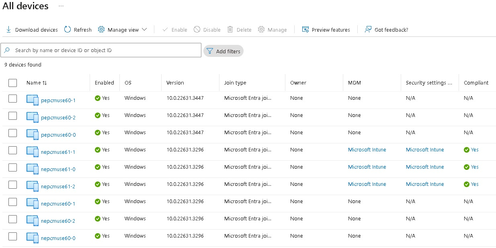
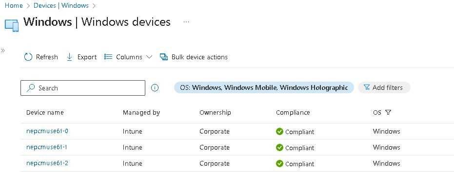

# Azure Virtual Desktop -Proof Of Concept - PowerShell version

- [Azure Virtual Desktop -Proof Of Concept - PowerShell version](#azure-virtual-desktop--proof-of-concept---powershell-version)
  - [Prerequisites](#prerequisites)
  - [Remark(s)](#remarks)
  - [Getting the code](#getting-the-code)
  - [Scenarios](#scenarios)
  - [Start.ps1](#startps1)
    - [What this script does ?](#what-this-script-does-)
    - [Script Explanation](#script-explanation)
    - [Azure Compute Gallery](#azure-compute-gallery)
  - [Testing](#testing)
  - [Deliverables](#deliverables)
    - [Limitations](#limitations)
    - [Azure Resources](#azure-resources)
    - [What's next ?](#whats-next-)

> [!IMPORTANT]
> The scripts I will use in this article rely on the [PSAzureVirtualDesktop](https://www.powershellgallery.com/packages/PSAzureVirtualDesktop) PowerShell module I developed. It illustrates some capabilities of the [PSAzureVirtualDesktop](https://www.powershellgallery.com/packages/PSAzureVirtualDesktop). You can use them as-is, customize it to meet your needs or use it as an inspiration to build your own script(s).
>
> The [PSAzureVirtualDesktop](https://www.powershellgallery.com/packages/PSAzureVirtualDesktop) module is my take on an Azure Virtual Desktop (AVD) Proof Of Concept (POC). It's not designed for production use and comes with no guarantees. I created it during my learning phase with Azure Virtual Desktop (AVD), aiming to consolidate some best practices and to quicky run POCs. The script encompasses both OnPrem and Azure configurations in a single PowerShell script.
>
> All explanations are available on the [GitHub](https://github.com/lavanack/PSAzureVirtualDesktop) site.
>
> **For a Microsoft-supported version deployment, I suggest using the Azure Virtual Desktop (AVD) Landing Zone Accelerator (LZA), which is available [here](https://github.com/Azure/avdaccelerator). Please note that this only covers the Azure component.**

>[!WARNING]
> The [PSAzureVirtualDesktop](https://www.powershellgallery.com/packages/PSAzureVirtualDesktop) module requires some other PowerShell modules (which are also automatically installed when you installs it) and you could receive this kind of error message when importing the module (via `Import-Module` or `#requires`)
>
> ``` powershell
> Import-Module : Function <...> cannot be created because function capacity 4096 has been exceeded for this scope
> ```
>
> You can simply fix by running the following PowerShell command line
>
> ``` powershell
> $Global:MaximumFunctionCount = 32768
> ```

## Prerequisites

It is recommended to use a dedicated Azure subscription when using the scripts I will explained just after. For Microsoft CSAs, you can request a new Azure subscription by clicking on this link [https://aka.ms/MCAPSNewAzureSub](https://aka.ms/MCAPSNewAzureSub) (Manager approval required).

Before proceeding, ensure that a domain controller is present in your Azure subscription. This requires a Windows Server with the Active Directory Directory Services role installed and configured. If this is not already set up, you can use the following links to create these resources. The options are listed from least to most preferred:

- [https://aka.ms/m365avdws](https://aka.ms/m365avdws)
- [https://github.com/lavanack/laurentvanacker.com/tree/master/Azure/Azure%20Virtual%20Desktop/AAD-Hybrid-Lab](https://github.com/lavanack/laurentvanacker.com/tree/master/Azure/Azure%20Virtual%20Desktop/AAD-Hybrid-Lab)
- [https://github.com/lavanack/laurentvanacker.com/tree/master/Azure/Azure%20Virtual%20Desktop/AAD-Hybrid-Lab%20-%20PowerShell](https://github.com/lavanack/laurentvanacker.com/tree/master/Azure/Azure%20Virtual%20Desktop/AAD-Hybrid-Lab%20-%20PowerShell) (Only the New-AAD-Hybrid-Lab.ps1: Step-by-step guide is needed - the rest is optional)

## Remark(s)
>
> [!IMPORTANT]
> The scripts have to be executed from the Domain Controller (from any local folder) you just deployed on the step before using an account with domain administrator privileges. An Azure privilege role (for example, Global Administrator) is also necessary to deploy the Azure resources.
>

## Getting the code

The first step is to download and install git (if you don't have it already). You can find the installation instructions [here](https://git-scm.com/book/en/Getting-Started-Installing-Git).

- You can run the following command to install the [PSAzureVirtualDesktop](https://www.powershellgallery.com/packages/PSAzureVirtualDesktop) PowerShell module from an elevated PowerShell console (with administrator privileges) :

```powershell
Get-PackageProvider -Name Nuget -ForceBootstrap -Force
Install-Module -Name PSAzureVirtualDesktop -Scope AllUsers -AllowClobber -SkipPublisherCheck -Force -Verbose
Update-Module -Name * -Force -Verbose
```

- You can clone the repository by running the following command in a PowerShell console for where you want:

```powershell
git clone https://github.com/lavanack/laurentvanacker.com.git
```

- Then go to the dedicated subfolder

```powershell
cd .\laurentvanacker.com\Azure\Azure Virtual Desktop\Setup
```

## Scenarios

The [Scenarios](./Scenarios/) subfolder contains two folders:

- [1 Azure Region](./Scenarios/1%20Azure%20Region/): For 1 Azure region deployment (the one where the Domain Controller is deployed)
- [2 Azure Regions](./Scenarios/2%20Azure%20Regions/): For 2 Azure regions deployment (the ones where the Domain Controllers are deployed - cf. [here](../AAD-Hybrid-Lab%20-%20PowerShell#new-aad-hybrid-bcdr-labps1-step-by-step-guide) - Paired Azure regions are recommended for BCDR and HA deployment)

Each folder mainly contains some very small specific scripts (1 line sometimes) for creating Azure Virtual Desktop HostPools (Thanks to the [HostPool PowerShell Class](https://github.com/lavanack/PSAzureVirtualDesktop/wiki/HostPool-PowerShell-Classes#hostpool-powershell-class-base-class) defined in the [PSAzureVirtualDesktop](https://www.powershellgallery.com/packages/PSAzureVirtualDesktop) PowerShell module) in a dedicated Azure region. The one you you used for deploying your Domain Controller (cf. [here](#prerequisites)). Two scripts are specific because they are used to deploy the HostPools :

- [Reset.ps1](./Scenarios/1%20Azure%20Region/Reset.ps1): Remove all resource groups matching the
'^rg-avd-.\*-poc-.\*-\d+' pattern used in the [PSAzureVirtualDesktop](https://www.powershellgallery.com/packages/PSAzureVirtualDesktop) PowerShell module, the dedicated Conditional Access Policy, the dedicated 'No-MFA Users' EntraID group for excluding some users/identities from MFA and call the [Start.ps1](./Scenarios/1%20Azure%20Region/Start.ps1) script.
- [Start.ps1](./Scenarios/1%20Azure%20Region/Start.ps1):
  
  This script has 2 optional parameters:
  - `-AsJob`: When specified, the HostPools  will be deployed in parallel (via the [Start-ThreadJob](https://learn.microsoft.com/en-us/powershell/module/threadjob/start-threadjob?view=powershell-7.4&viewFallbackFrom=powershell-5.1) cmdlet) instead of sequentially. The processing time is greatly reduced from 4.5 hours to 1.5 hours (including the Azure Compute Gallery Setup if needed - without the Azure Compute Gallery Setup, the processing time are 3.5 hours sequentially  and 45 minutes in parallel) for the proposed HostPool configurations. Of course, the fewer configurations you define, the shorter the processing time will be (especially in sequential mode).

  - `-LogDir`: The folder where you want to put the generated log files.

> [!IMPORTANT]
> The script was created to deployed all the required resources from a unique call. It is not designed (not tested for the moment to be honest) to be called in an incremental mode (deploying a HostPool and updating the infrastructure by adding another one after). So create you own dedicated scenario files with all the required resources.
>

## Start.ps1

### What this script does ?

This script is designed to quickly deploy multiple full Azure Virtual Desktop environments, in minutes to hours. It adheres to Microsoft documentation and recommended practices.
Each time the script is run, a transcription with a timestamp will be created in the dedicated [Scenarios](./Scenarios/) subfolder.

### Script Explanation

This script is basically doing the following tasks:

- Import the [PSAzureVirtualDesktop](https://www.powershellgallery.com/packages/PSAzureVirtualDesktop) PowerShell module (if not already imported)

> [!NOTE]
> If you receive the error message `Function <...> cannot be created because function capacity 4096 has been exceeded for this scope`, you can fix it by running the following command line in your PowerShell console (before importing the module or running the script):
>
>```powershell
>$Global:MaximumFunctionCount = 32768
>```

- Start a timestamped transcript file (`Start_yyyyMMddHHmmss.txt` as naming convention) in the `$LogDir` folder
- Test if the running VM is the Domain Controller (Thanks to the [Test-DomainController](https://github.com/lavanack/PSAzureVirtualDesktop/wiki/Test-Domaincontroller) function)(if not, the script will stop)
- Connect to Azure and Graph (if not already connected) via the [Connect-PsAvdAzure](https://github.com/lavanack/PSAzureVirtualDesktop/wiki/Connect-PsAvdAzure) function
- Registering the required Azure Resource Providers (if not already registered) via the [Register-PsAvdRequiredResourceProviders](https://github.com/lavanack/PSAzureVirtualDesktop/wiki/Register-PsAvdRequiredResourceProvider) function
- Install some GPO settings (if not already installed) for AVD and FSLogix via the [Install-PsAvdFSLogixGpoSettings](https://github.com/lavanack/PSAzureVirtualDesktop/wiki/Install-PsAvdFSLogixGpoSettings) and [Install-PsAvdAvdGpoSettings](https://github.com/lavanack/PSAzureVirtualDesktop/wiki/Install-PsAvdAvdGpoSettings) functions.
- Customize (Change to reflect your own settings) some settings related to the 1 or 2 Azure regions where you want to deploy your Azure resources

  - The ResourceGroup containing the Domain Controller
  - The Virtual Network Name to use for attaching the AVD resources
  - The Subnet Name to use for attaching the AVD resources
  - The Virtual Network to use for attaching the AVD resources
  - The Subnet to use for attaching the AVD resources
  - The Azure region to use (The Azure region of the Virtual Network)
  
- Create a KeyVault for storing the the Session Host credentials (if one with the '^kvavdhpcred' pattern is not found in the Azure subscription) via the [New-PsAvdHostPoolSessionHostCredentialKeyVault](https://github.com/lavanack/PSAzureVirtualDesktop/wiki/New-PsAvdHostPoolSessionHostCredentialKeyVault) function.
  - The credentials will be stored as secrets in the Azure Key Vault:

  - `ADJoinUserName`: The user name for the account used to join the Session Hosts to the Active Directory domain
  - `ADJoinPassword`: The password for the account used to join the Session Hosts to the Active Directory domain
  - `LocalAdminUserName`: The user name for the local administrator account on the Session Hosts
  - `LocalAdminPassword`: The password for the local administrator

  You can also use your own Azure Key Vault (with these 4 secret names) or let the script create one for you with the `New-PsAvdHostPoolSessionHostCredentialKeyVault` function.
  The [New-PsAvdHostPoolSessionHostCredentialKeyVault](https://github.com/lavanack/PSAzureVirtualDesktop/wiki/New-PsAvdHostPoolSessionHostCredentialKeyVault) waits for two optional PSCredential objects :

  - `LocalAdminCredential`
  - `ADJoinCredential`.

  > [!NOTE]
  > If you don't specify the `LocalAdminCredential` parameter when calling the [New-PsAvdHostPoolSessionHostCredentialKeyVault](https://github.com/lavanack/PSAzureVirtualDesktop/wiki/New-PsAvdHostPoolSessionHostCredentialKeyVault) function, the `LocalAdminUserName` will be automatically set to the `localadmin` value (as the sAMAccountName) and the `LocalAdminPassword` will be automatically set via the [New-RandomPassword](https://github.com/lavanack/PSAzureVirtualDesktop/wiki/New-RandomPassword) function. For `ADJoinCredential`: If you don't specify it, `adjoin` will be used as the sAMAccountName and the password will also be randomly generated (via the [New-RandomPassword](https://github.com/lavanack/PSAzureVirtualDesktop/wiki/New-RandomPassword) function).
  >
  > The used/generated KeyVault will be secured with a dedicated Azure Private Endpoint (if not already created) and a dedicated Azure Private DNS Zone (if not already created) via the [New-PsAvdPrivateEndpointSetup](https://github.com/lavanack/PSAzureVirtualDesktop/wiki/New-PsAvdPrivateEndpointSetup) function

  > [!IMPORTANT]
  > If the `ADJoinCredential` account doesn't exist in the Active Directory, it will be created later in the script processing (in the [Grant-ADJoinPermission](https://github.com/lavanack/PSAzureVirtualDesktop/wiki/Grant-PsAvdADJoinPermission) function). But if the account already exists in the Active Directory, you have to specify the current sAMAccountNAme and password for this account.

- Listing Azure VMs with Ephemeral OS Disk in the Azure region (if any) via the [Get-AzureEphemeralOsDiskSku](https://github.com/lavanack/PSAzureVirtualDesktop/wiki/Get-AzureEphemeralOsDiskSku) static function). This call is used just for information purpose.

- Generate a random starting number for numbering the Resource Groups  and the HostPools to limit or avoid duplicated names for Storage Accounts.
- Apply a scenario from the [Scenarios](./Scenarios/) subfolder (Uncomment the scenario you want to deploy or create a new scenario)
- Do some cleanup tasks for removing the previously deployed Azure resources via the [Remove-PsAvdHostPoolSetup](https://github.com/lavanack/PSAzureVirtualDesktop/wiki/Remove-PsAvdHostPoolSetup) function.
- Check the name availability for the genearted Storage Account and Key Vault (based on the used naming convention) respectively via the [Test-PsAvdStorageAccountNameAvailability](https://github.com/lavanack/PSAzureVirtualDesktop/wiki/Test-PsAvdStorageAccountNameAvailability) and [Test-PsAvdKeyVaultNameAvailability](https://github.com/lavanack/PSAzureVirtualDesktop/wiki/Test-PsAvdKeyVaultNameAvailability) functions.
- Backup the HostPool configuration in a JSON file via the [New-PsAvdHostPoolBackup](https://github.com/lavanack/PSAzureVirtualDesktop/wiki/New-PsAvdHostPoolBackup) function. The backup location is specified via the `-Directory` input parameter.
- Deploy the HostPools via the [New-PsAvdHostPoolSetup](https://github.com/lavanack/PSAzureVirtualDesktop/wiki/New-PsAvdHostPoolSetup) function. The [New-PsAvdHostPoolSetup](https://github.com/lavanack/PSAzureVirtualDesktop/wiki/New-PsAvdHostPoolSetup) is the core function and has some parameters
  - `$HostPool` as [HostPool](https://github.com/lavanack/PSAzureVirtualDesktop/wiki/HostPool-PowerShell-Classes#hostpool-powershell-class-base-class) array (This variable is set directly from the scripts you can find in the [Scenarios](./Scenarios/) subfolders or set the value you want for the HostPool(s) you want to deploy). It will deploy all the resources needed for the HostPool(s) based on the specified value. All information on configuring the HostPool(s) can be found [here](https://github.com/lavanack/PSAzureVirtualDesktop/wiki/HostPool-PowerShell-Classes).
  - `NoMFAEntraIDGroupName`: The name of the EntraID group used to exclude some users/identities from MFA. This EntraID group is used for HostPools using EntraID as identity provider. Id the group doesn't exist, it will be created. The group name is `No-MFA Users` by default.
  - `$LogDir`: The folder where you want to put the generated log files.
  - `AMBA`: If specified, the script will deploy some Azure Monitor Baseline Alerts (AMBA) for [Azure Virtual Desktop](https://azure.github.io/azure-monitor-baseline-alerts/patterns/specialized/avd/) via the [New-PsAvdAzureMonitorBaselineAlertsDeployment](https://github.com/lavanack/PSAzureVirtualDesktop/wiki/New-PsAvdAzureMonitorBaselineAlertsDeployment) function. More information about the [AMBA](https://aka.ms/amba) can be found on [https://aka.ms/amba](https://aka.ms/amba).
  - `WorkBook`: if specified, some useful AVD Worbooks are imported via the [Import-PsAvdWorkbook](https://github.com/lavanack/PSAzureVirtualDesktop/wiki/Import-PsAvdWorkbook) function.
  - `Restart`: If specified, the script will restart the session hosts after the setup.
  - `RDCMan`: if specified, the script will create a Remote Desktop Connection Manager (RDCMan) file at the end of the deployment (named \<domain name\>.rdg) on the Desktop with all information to connect to the deployed Azure VMs. You can use this file with the [Remote Desktop Connection Manager](https://download.sysinternals.com/files/RDCMan.zip) tool to connect to the Session Hosts. For the Azure AD/Microsoft Entra ID joined VM, the local admin credentials are stored in this file for an easier connection. For the AD Domain joined VM, the current logged in user is used. You just have to fill the password. Right click on the AVD section, go to the "Logon Credentials" tab, uncheck "Inherit from parent" and fill the password. It will be inherited at the lower levels.
  

- `$AsJob`: The HostPool(s) will be deployed in parallel if specified or sequentially (if not specified).

> [!NOTE]
> The impacted ressources by the parallel mode are only the HostPools and the Session Hosts. The Job Management is done at the end of the [New-PsAvdHostPoolSetup](https://github.com/lavanack/PSAzureVirtualDesktop/wiki/New-PsAvdHostPoolSetup)  function.

> [!NOTE]
> Some Tags are added to every deployed AVD Host Pool with related information about the underlying configuration.

- Run a Windows Explorer instance for every Azure file share created for the FSLogix and [MSIX AppAttach](https://learn.microsoft.com/en-us/azure/virtual-desktop/app-attach-overview?pivots=msix-app-attach)/[Azure AppAttach](https://learn.microsoft.com/en-us/azure/virtual-desktop/app-attach-overview?pivots=app-attach) resources via the [Get-PsAvdFSLogixProfileShare](https://github.com/lavanack/PSAzureVirtualDesktop/wiki/Get-PsAvdFSLogixProfileShare) and [Get-PsAvdMSIXProfileShare](https://github.com/lavanack/PSAzureVirtualDesktop/wiki/Get-PsAvdMSIXProfileShare) functions
- Add the `AVD Users` group as member of every generated AD group (for the HostPool(s) you deployed)
- Updating the location for all users to the specified location (2-Letter ISO format - "FR" for France for example) via the [Update-PsAvdMgBetaUserUsageLocation](https://github.com/lavanack/PSAzureVirtualDesktop/wiki/Update-PsAvdMgBetaUserUsageLocation) function
- Assign some licences (if any available) to the users in the `AVD Users` group via the [Set-PsAvdMgBetaUsersGroupLicense](https://github.com/lavanack/PSAzureVirtualDesktop/wiki/Set-PsAvdMgBetaUsersGroupLicense) function. The SKU Part Number is specified in the `-SkuPartNumber` parameter.

### Azure Compute Gallery

Some scenarios look for Azure Compute Gallery in the deployment region. If none is found then a new one is created via the [New-AzureComputeGallery](https://github.com/lavanack/PSAzureVirtualDesktop/wiki/New-AzureComputeGallery) function (~45 min for the processing time). All details are [here](../Azure%20Image%20Builder#azureimagebuilderps1) (AzureImageBuilder.ps1 paragraph only - nevertheless you can read all the article to see  some possibilities an Azure Compute Gallery can offer).
> [!WARNING]
> In July 2024, A bug was filled (more details [here](https://github.com/Azure/RDS-Templates/issues/793#issuecomment-2259928963)) about the failure of the Custom Image Template for AVD because of Windows Update. I commented the Azure Compute Gallery part due to this bug. I will uncomment it when the bug will be fixed.

## Testing

After a successful deployment, you can connect by using either [Remote Desktop Web Client](https://client.wvd.microsoft.com/arm/webclient/index.html), [Windows 365](https://windows365.microsoft.com/) or the [Windows App](https://www.microsoft.com/store/productId/9N1F85V9T8BN?ocid=pdpshare) site and use one of the test users (available in `AVD Users` AD group in the `OrgUsers` OU).

## Deliverables

At the end of the deployment, the following deliverables are available (the following screenshots reflect the default values):

- A timestamped transcript file in the script directory
- A timestamped JSON file `HostPool_yyyyMMddHHmmss.json` in the `Backup` subfolder of the script directory as a reminder of the deployed HostPool(s) configuration
- A .rdg file on the Desktop with all the information to connect to the Session Hosts (cf. [here](#remote-desktop-connection-manager))
- A dedicated Organization Unit (OU) in the Active Directory domain for every HostPool


- Some GPOs
  - 'AVD Global Settings' GPO linked to the `AVD` OU
  - '`<HostPoolName>` - FSLogix Settings' GPO linked to the `<HostPoolName>` OU for the FSLogix Settings (if FSLogix is required) per HostPool
  - '`<HostPoolName>` - MSIX Settings' GPO linked to the `<HostPoolName>` OU for the MSIX Settings (if [MSIX AppAttach](https://learn.microsoft.com/en-us/azure/virtual-desktop/app-attach-overview?pivots=msix-app-attach) or [Azure AppAttach](https://learn.microsoft.com/en-us/azure/virtual-desktop/app-attach-overview?pivots=app-attach) is required) per HostPool
  - 2 starter GPOs linked to the `AVD` OU
    - 'Group Policy Reporting Firewall Ports'
    - 'Group Policy Remote Update Firewall Ports'


- Different HostPools (based on the HostPool type you setup)


- Some Azure AD/Microsoft Entra ID Devices
  


- Some AD Computers Objects
  


- Intune
  - Devices
  
  - Configuration Profiles
  
  - Platform Scripts
  

- Workspaces


### Limitations

- I'm not using Application Security Group (only Network Security Groups).
- FSLogix, [MSIX AppAttach](https://learn.microsoft.com/en-us/azure/virtual-desktop/app-attach-overview?pivots=msix-app-attach) and [Azure AppAttach](https://learn.microsoft.com/en-us/azure/virtual-desktop/app-attach-overview?pivots=app-attach) features are only implemented for Pooled HostPools

### Azure Resources

The script will deploy the following Azure resources (ordered by alphabetical order):

- Azure Compute Gallery
  - Image Definition
  - Image Version
- Azure File Share (for FSLogix and [MSIX AppAttach](https://learn.microsoft.com/en-us/azure/virtual-desktop/app-attach-overview?pivots=msix-app-attach)/[Azure AppAttach](https://learn.microsoft.com/en-us/azure/virtual-desktop/app-attach-overview?pivots=app-attach))
- Azure Key Vault
- Azure Private Endpoint (for Azure File Share and Azure Key Vault)
- Azure Resource Group
- Azure Private DNS Zone (for Azure File Share and Azure Key Vault)
  - Virtual Network Link
- Azure Storage Account
- Azure Virtual Desktop
  - Host Pools
  - Application Groups
  - Workspaces
  - Session Hosts (Azure Virtual Machines, Azure Disk, Azure Network Interface, Azure Virtual Machine Extension)
  - Scaling Plans
- Data Collection Rules
- EntraID Conditional Access Policies
- EntraID Dynamic Groups
- EntraID Security Groups
- Intune
  - Devices
  - Intune Configuration Profiles
  - Intune Platform Scripts
- Log Analytics Workspace

### What's next ?

I will probably integrate the following features in the script (when time permits and not necessarily in this order):

- [Use Azure Private Link to connect networks to Azure Monitor](https://learn.microsoft.com/en-us/azure/azure-monitor/logs/private-link-security)
- Write a PowerShell 7+ version of the script (I'm using PowerShell 5.1 for the moment)
