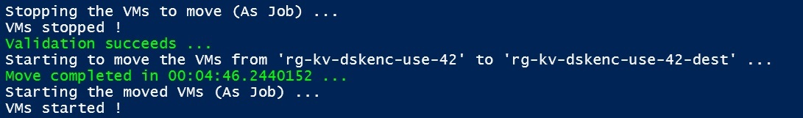

# Moving Azure VM to Another Resource Group with PowerShell

- [Moving Azure VM to Another Resource Group with PowerShell](#moving-azure-vm-to-another-resource-group-with-powershell)
  - [New-AzCMKVM.ps1](#new-azcmkvmps1)
  - [Move-AzResource.ps1](#move-azresourceps1)

## New-AzCMKVM.ps1

The [New-AzCMKVM.ps1](New-AzCMKVM.ps1) script creates 25 (By default) Azure VMs with Customer Managed Key (CMK) encryption enabled. It is a variant of the [following](../../Azure%20Key%20Vault/Azure%20Key%20Vault%20for%20Disk%20Encryption%20with%20Generated%20Customer%20Managed%20Key.ps1) script.

There are some optional parameters

- `$VMNumber`: The number of VMs to create (Default is 10 - Standard_D8as_v5 VM size is used - beware of your quota)
- `$JIT`: If present, the Just-In-Time (JIT) VM Access is enabled for RDP access to the VMs
- `DataDisk`: If present, a data disk is added to the VMs
- `Linux`: If present, the VMs are created with a Linux OS
- `SSHPublicKeyPath`: The path to the SSH public key for Linux VMs
- `NoPublicIP`: If present, the VMs are created without a Public IP

At the end of the script, a command line is generated (copy and paste it) for moving all the VMs to another resource group (which is also created during the processing of the [New-AzCMKVM.ps1](New-AzCMKVM.ps1) script).

## Move-AzResource.ps1

The [Move-AzResource.ps1](Move-AzResource.ps1) script contains the Move-AzResource function for moving all VMS to a new subscription.

The Move-AzResource function has two mandatory parameters and an optional one (switch)

- `$SourceResourceGroupName`: The source resource group name
- `TargetResourceGroupName`: The target resource group name
- `Start`: If present, the VMs will be automatically started after the move

> [!NOTE]
> The VMs are deallocated before the move.
>
> A validation test is done before the move to ensure that the move is possible (like the [Azure Resource Mover](https://azure.microsoft.com/products/resource-mover/) tool).
>
> The 25 VMS are moved in less than 5 minutes as shown in the following screenshot.
>

