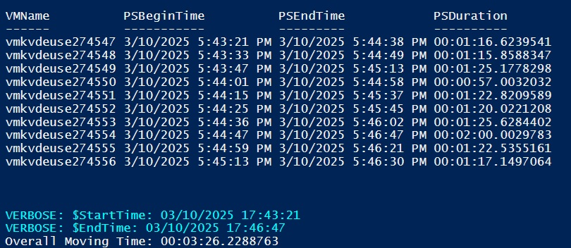

# Moving Azure VM to Subscription with PowerShell

- [Moving Azure VM to Subscription with PowerShell](#moving-azure-vm-to-subscription-with-powershell)
  - [New-AzCMKVM.ps1](#new-azcmkvmps1)
  - [Move-AzResource.ps1](#move-azresourceps1)

## New-AzCMKVM.ps1

The [New-AzCMKVM.ps1](New-AzCMKVM.ps1) script creates 10 (By default) Azure VMs with Customer Managed Key (CMK) encryption enabled. It is a variant of the [following](../../Azure%20Key%20Vault/Azure%20Key%20Vault%20for%20Disk%20Encryption%20with%20Generated%20Customer%20Managed%20Key.ps1) script.

There are some optional parameters

- `$VMNumber`: The number of VMs to create (Default is 10 - Standard_D8as_v5 VM size is used - beware of your quota)
- `$JIT`: If present, the Just-In-Time (JIT) VM Access is enabled for RDP access to the VMs
- `DataDisk`: If present, a data disk is added to the VMs
- `Linux`: If present, the VMs are created with a Linux OS
- `SSHPublicKeyPath`: The path to the SSH public key for Linux VMs
- `NoPublicIP`: If present, the VMs are created without a Public IP

At the end of the script, a command line is generated (copy and paste it) for moving all the VMs to a new subscription.

## Move-AzResource.ps1

The [Move-AzResource.ps1](Move-AzResource.ps1) script contains the Move-AzResource function for moving all VMS (We copy the disks and create a new VM - The NIC and the Public IP Address (if any) are recreated) to another subscription.

The Move-AzResource function has the follwing mandatory parameters and some optional ones (switch)

- `VM`: The VMs to move (can be passed via the pipeline)
- `TargetResourceGroupName`: The target resource group name
- `TargetSubscriptionId`: The target subscription ID
- `TargetDiskEncryptionSetId` The target Disk Encryption Set ID
- `TargetSubnetId`: The target subnet ID
- `$Snapshot`: If present, the VMs are moved with via a snapshot of the disks
- `AsJob`: If present, the VMs are moved in parallel (using jobs)

> [!NOTE]
> The 10 VMS are moved in less than 4 minutes (when using jobs) as shown in the following screenshot. Without jobs, you can expect a time of 90 seconds per VM.

