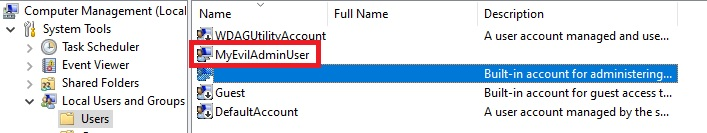

# Azure Automage Machine Configuration

The [1 - AzureVMWithAzureAutomanageMachineConfiguration](1%20-%20AzureVMWithAzureAutomanageMachineConfiguration.ps1) script creates a Windows Azure VM. After, you'll have to run the [2 - Prerequisites.ps1](2%20-%20Prerequisites.ps1) and [3 - AzureAutomanageMachineConfiguration.ps1](3%20-%20AzureAutomanageMachineConfiguration.ps1) scripts from the newly created Azure VM to create an rogue Administrator account.

## Table of Contents

- [Azure Automage Machine Configuration](#azure-automage-machine-configuration)
  - [Table of Contents](#table-of-contents)
  - [Prerequisites](#prerequisites)
    - [Setup](#setup)

## Prerequisites

- An [Azure](https://portal.azure.com) Subscription

### Setup

- Run the [1 - AzureVMWithAzureAutomanageMachineConfiguration.ps1](1%20-%20AzureVMWithAzureAutomanageMachineConfiguration.ps1) script (PowerShell 5.1 needed) wait for completion (~10 minutes).
- Copy the 'Azure Automanage Machine Configuration' folder on the Azure VM (wherever you want) and go to the 'Windows' subfolder.
- Run the [2 - Prerequisites.ps1](2%20-%20Prerequisites.ps1) script from the Azure VM to install some prerequisites (Powershell modules, [PowerShell 7+](https://github.com/PowerShell/powershell/releases), [Visual Studio Code](https://code.visualstudio.com/), ...).  The script ends by opening **Visual Studio Code** in the current directory
- After run the [3 - AzureAutomanageMachineConfiguration.ps1](3%20-%20AzureAutomanageMachineConfiguration.ps1) from the opened **Visual Studio Code** instance (inside the Azure VM). This script will start by applying the [Deploy prerequisites to enable Guest Configuration policies on virtual machines](https://github.com/Azure/azure-policy/blob/master/built-in-policies/policySetDefinitions/Guest%20Configuration/GuestConfiguration_Prerequisites.json) initiative and will deploy your Desired State Configuration (Rogue Administrator creation) just after.

> [!NOTE]
> If you are already connected (via [Connect-AzAccount](https://learn.microsoft.com/en-us/powershell/module/az.accounts/connect-azaccount)) to the right Azure subscription (mentionned around the line 65 - change to reflect your subscription name) this setup will be fully unattended else you will be prompted to connect and to select the right subscription.
>
> The Azure VM will run the latest version of 'Windows Server 2022 Datacenter (Desktop Experience)' Generation 2 in a [Standard_D4s_v5](https://learn.microsoft.com/en-us/azure/virtual-machines/dv5-dsv5-series) Azure VM.
> The Azure VM will be a [Spot Instance](https://learn.microsoft.com/en-us/azure/virtual-machines/spot-vms) with a 'Deallocate' [eviction policy](https://learn.microsoft.com/en-us/azure/architecture/guide/spot/spot-eviction#eviction-policy) based on capacity (not price) to save money. You can disable that if you want (around line 185 in the [1 - AzureVMWithAzureAutomanageMachineConfiguration.ps1](1%20-%20AzureVMWithAzureAutomanageMachineConfiguration.ps1) script).
>
> The VM will be deployed on the eastus region (You can use the non Microsoft <https://cloudprice.net/> web site to compare cost in different regions for cost savings) . You can change  that if you want (around line 79 in the [[1 - AzureVMWithAzureAutomanageMachineConfiguration.ps1](1%20-%20AzureVMWithAzureAutomanageMachineConfiguration.ps1) script).
>
> The VM name is randomly generated with the template vmdscamcYYYXXXX where YYY and a 3-letter acronym for the Azure location and X is a digit to avoid duplicate names (an availability test is done around line 82 in the [[1 - AzureVMWithAzureAutomanageMachineConfiguration.ps1](1%20-%20AzureVMWithAzureAutomanageMachineConfiguration.ps1) script). A global naming convention is also set for all Azure resources.
>
> A DNS Name is set under the form \<VMName\>.\<Location\>.cloudapp.azure.com (for instance dscazamc31415926.westus3.cloudapp.azure.com) and used for the browser connection (the pblic IP is not directly used).
>
> A daily scheduled shutdown at 11:00 PM (in your local timezone) is set for the VM (no automatic start is set).
>
> The RDP connection is only accessible from the IP where you run the script (done via a query to <https://ipv4.seeip.org>) via a [Network Security Group](https://learn.microsoft.com/en-us/azure/virtual-network/network-security-group-how-it-works). If you want to give access to people from different IP you has to customize the RDP rule of the NSG or use the JIT access policy (next point).

>
> A just-in-time access policy (3-hour long) is also set for RDP access.

>
> The HTTP and HTTPS connections (TCP/80 and TCP/443) are accessible from everywhere
> The password (for RDP connection) is randomly generated and displayed at the beginning and copied into your clipboard. The account name used is the same you are currently using (cf. the Username environment variable - so almost different for everyone). In addition these credentials will also be displayed at the end of the deployment process (in green) and added in the Credential Manager for an automatic connection in the upcoming RDP session (next point).
>
> A RDP session will be automatically opened at the end of the deployment process.
