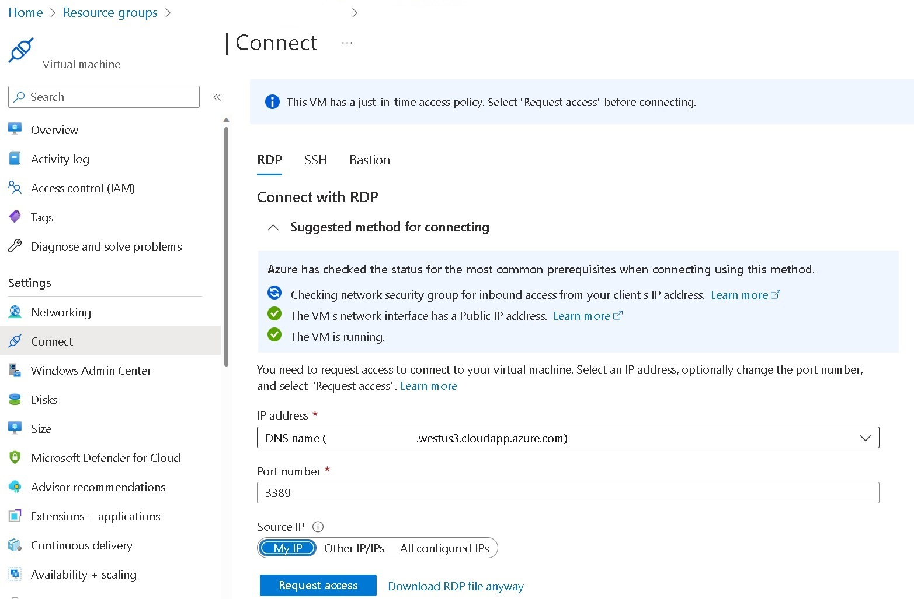

# Azure Desired State Configuration

The [1 - AzureVMWithDSCExtension.ps1](./1%20-%20AzureVMWithDSCExtension.ps1) script creates an Azure VM with IIS installed and a custom welcome page.

- [Azure Desired State Configuration](#azure-desired-state-configuration)
  - [Prerequisites](#prerequisites)
  - [Setup](#setup)

## Prerequisites

- An [Azure](https://portal.azure.com) Subscription

## Setup

Run the [1 - AzureVMWithDSCExtension.ps1](./1%20-%20AzureVMWithDSCExtension.ps1) script (PowerShell 5.1 needed) wait for completion (~15 minutes).

**Notes:**

- If you are already connected (via [Connect-Azaccount](https://learn.microsoft.com/en-us/powershell/module/az.accounts/connect-azaccount)) to the right Azure subscription (mentionned around the line 74 - change to reflect your subscription name) this setup will be fully unattended else you will be asked to connect and to select the right subscription.
- The Azure VM will run the latest version of 'Windows Server 2022 Datacenter (Desktop Experience)' Generation 2 in a [Standard_D4s_v5](https://learn.microsoft.com/en-us/azure/virtual-machines/dv5-dsv5-series) Azure VM.
- The Azure VM will be a [Spot Instance](https://learn.microsoft.com/en-us/azure/virtual-machines/spot-vms) with a 'Deallocate' [eviction policy](https://learn.microsoft.com/en-us/azure/architecture/guide/spot/spot-eviction#eviction-policy) based on capacity (not price) to save money. You can disable that if you want (around line 223 in the [[1 - AzureVMWithDSCExtension.ps1](./1%20-%20AzureVMWithDSCExtension.ps1) script).
- The WM will be deployed on the eastus region (You can use the non Microsoft <https://azureprice.net/> web site to compare cost in different regions) . You can change  that if you want (around line 79 in the [[1 - AzureVMWithDSCExtension.ps1](./1%20-%20AzureVMWithDSCExtension.ps1) script).
- We rely on <https://github.com/microsoft/CloudAdoptionFramework/tree/master/ready/AzNamingTool> for the naming convention of all Azure resources. We append a random number (the same for all resources in the only resource group we used) at the end to avoid duplicate names (an availability test is done around line 103 in the [[1 - AzureVMWithDSCExtension.ps1](./1%20-%20AzureVMWithDSCExtension.ps1) script).
- A DNS Name is set under the form \<VMName\>.\<Location\>.cloudapp.azure.com and used for the browser connection (the public IP is not directly used).
- A daily scheduled shutdown at 11:00 PM (in your local timezone) is set for the VM (no automatic start is set).
- The RDP connection is only accessible from the IP where you run the script (done via a query to <http://ifconfig.me/ip>) via a [Network Security Group](https://learn.microsoft.com/en-us/azure/virtual-network/network-security-group-how-it-works). If you want to give access to people from different IP you has to customize the RDP rule of the NSG or use the JIT access policy (next point).

- The HTTP/HTTPS connection (TCP/80 and TCP/443) is also only accessible from the IP where you run the script.
- A just-in-time access policy (3-hour long) is also set for RDP access.

- The password (for RDP connection) is randomly generated and displayed at the beginning and copied into your clipboard. The account name used is the same you are currently using (cf. the Username environment variable - so almost different for everyone). In addition these credentials will also be displayed at the end of the deployment process (in green) and added in the Credential Manager for an automatic connection in the upcoming RDP session (next point).
- A RDP session will be automatically opened at the end of the deployment process and the browser will be opened to the IIS website
