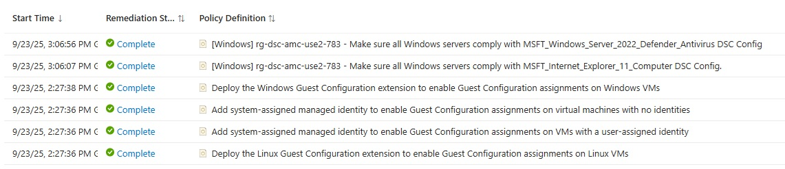

# Microsoft Security Compliance Toolkit baselines with Azure Machine Configuration

[](https://learn.microsoft.com/en-us/azure/governance/machine-configuration/)
[](https://github.com/PowerShell/PowerShell)
[](https://learn.microsoft.com/en-us/powershell/dsc/)

> **Automated Azure VM deployment with comprehensive DSC configurations for security and compliance management**

## 📋 Table of Contents

- [Overview](#-overview)
- [Quick Start](#-quick-start)
- [Prerequisites](#-prerequisites)
- [Installation & Setup](#-installation--setup)
- [DSC Configurations](#-dsc-configurations)
- [Results](#-results)
- [Configuration Options](#-configuration-options)
- [Security Features](#-security-features)
- [Troubleshooting](#-troubleshooting)
- [Additional Resources](#-additional-resources)

## 📋 Overview

This project combines the [Convert Microsoft Security Compliance Baselines to Azure Machine Configuration Packages](https://github.com/lavanack/laurentvanacker.com/tree/master/Windows%20Powershell/Windows/Security/Convert-FromSecurityComplianceToolkit) solution with Azure Machine Configuration (formerly Guest Configuration). This implementation is similar to the solution described in the [Azure Machine Configuration](https://github.com/lavanack/laurentvanacker.com/tree/master/Azure/Desired%20State%20Configuration/Azure%20Machine%20Configuration/Windows/General) article but specifically applied to [**Microsoft Security Compliance Toolkit** baselines](https://www.microsoft.com/en-us/download/details.aspx?id=55319) context.

## 🚀 Quick Start

Get started in 3 simple steps:

1. **Deploy Azure VM** *(~10 minutes)*  
   Run [`1 - AzureVMWithAzureAutomanageMachineConfiguration.ps1`](1%20-%20AzureVMWithAzureAutomanageMachineConfiguration.ps1)

2. **Install Prerequisites** *(~5 minutes)*  
   Execute [`2 - Prerequisites.ps1`](2%20-%20Prerequisites.ps1) on the VM

3. **Apply Configurations** *(~15 minutes)*  
   Run [`3 - AzureAutomanageMachineConfigurationSCTWithSystemAssignedIdentity.ps1`](3%20-%AzureAutomanageMachineConfigurationSCTWithSystemAssignedIdentity.ps1)

## 🔧 Prerequisites

### Required Resources

- **Azure Subscription** - Active [Azure subscription](https://portal.azure.com) with appropriate permissions
- **PowerShell 5.1+** - Required for initial deployment script
- **Azure PowerShell Module** - For Azure resource management

### Permissions Required

- **Contributor** access to the target Azure subscription
- **User Access Administrator** (for role assignments)
- **Resource Group** creation permissions

## 🚀 Installation & Setup

### Step 1: Deploy Azure VM

Deploy the base infrastructure from your local machine:

```powershell
.\1 - AzureVMWithAzureAutomanageMachineConfiguration.ps1
```

**What this script does:**

- Creates a Windows Server 2022 Azure VM
- Configures network security groups and JIT access
- Sets up Azure Machine Configuration prerequisites
- Copies required files to the VM

**Duration**: ~10 minutes  
**Requirements**: PowerShell 5.1+, Azure PowerShell module, Azure connection

### Step 2: Install Prerequisites on VM

Connect to your deployed VM and set up the required components:

1. The 'Azure Machine Configuration' folder is automatically copied to the System drive
2. Navigate to the folder:

   ```cmd
   cd "C:\Azure Machine Configuration\Windows\Microsoft Security Compliance Toolkit"
   ```

3. Run the prerequisites script:

   ```powershell
   .\2 - Prerequisites.ps1
   ```

**What this script installs:**

- Required PowerShell modules (BaselineManagement, SecurityPolicyDsc, etc.)
- PowerShell 7+ runtime
- Visual Studio Code (for script editing)
- Azure PowerShell dependencies

**Duration**: ~5 minutes

### Step 3: Apply DSC Configurations

This script will prompt you twice as previously explained in the [DSC Configurations](#-dsc-configurations) section.

```powershell
.\3 - AzureAutomanageMachineConfigurationSCTWithSystemAssignedIdentity.ps1
```

> **Note**: System Assigned Identity is the recommended approach for production environments. More details: [Azure Policy Definition Guide](https://learn.microsoft.com/en-us/azure/governance/machine-configuration/how-to/create-policy-definition#create-an-azure-policy-definition)

## 🔧 DSC Configurations

The applied Desired State Configurations come from the [Convert Microsoft Security Compliance Baselines to Desired State Configuration Machine Configuration Packages](https://github.com/lavanack/laurentvanacker.com/tree/master/Windows%20Powershell/Windows/Security/Convert-FromSecurityComplianceToolkit) article. You will be prompted twice in the [`3 - AzureAutomanageMachineConfigurationSCTWithSystemAssignedIdentity.ps1`](3%20-%AzureAutomanageMachineConfigurationSCTWithSystemAssignedIdentity.ps1) script:

1. **Security Baseline Selection** (Single Selection)  
   Choose from the [Operating System or Security Topic](/Windows%20Powershell/Windows/Security/Convert-FromSecurityComplianceToolkit/readme.md#visual-examples). We recommend selecting **Windows Server 2022 Security Baseline** as the deployed Azure VM runs Windows Server 2022.

   

2. **GPO Selection** (Multiple Selections Allowed)  
   The available GPO names will be based on your previous selection.

   

## 📊 Results

Upon successful completion, all related [Azure Policies and Initiatives](https://portal.azure.com/#view/Microsoft_Azure_Policy/PolicyMenuBlade/~/Remediation) will be applied to your Azure VM. The deployment process creates and assigns policies based on the Microsoft Security Compliance Toolkit baselines you selected.



### What Gets Applied

- **Security Policies**: Windows Server 2022 security baselines
- **Compliance Monitoring**: Continuous assessment of security posture
- **Remediation Tasks**: Automatic correction of non-compliant settings
- **Reporting**: Detailed compliance reports in Azure Policy dashboard

## ⚙️ Configuration Options

### Virtual Machine Specifications

| Setting           | Default Value                                                                               | Customizable | Script Line |
| ----------------- | ------------------------------------------------------------------------------------------- | ------------ | ----------- |
| **OS**            | Windows Server 2022 Datacenter (Desktop Experience)                                         | ✅            | ~389        |
| **Generation**    | Generation 2                                                                                | ✅            | ~389        |
| **VM Size**       | [Standard_D4s_v5](https://learn.microsoft.com/en-us/azure/virtual-machines/dv5-dsv5-series) | ✅            | ~330        |
| **Region**        | East US 2                                                                                   | ✅            | ~329        |
| **Instance Type** | [Spot Instance](https://learn.microsoft.com/en-us/azure/virtual-machines/spot-vms)          | ✅            | ~185        |

### Network & Security Configuration

- **RDP Access**: Restricted to deployment IP address only
- **HTTP/HTTPS Ports**: Open to internet (ports 80/443)
- **DNS Name**: `<VMName>.<Location>.cloudapp.azure.com`
- **Just-in-Time Access**: 3-hour policy enabled automatically
- **Network Security Groups**: Automatically configured with minimal required access

### Cost Optimization Features

- **Spot Instance**: Enabled by default with 'Deallocate' eviction policy
- **Auto-shutdown**: Daily at 11:00 PM (local timezone)
- **Region Selection**: Use [CloudPrice.net](https://cloudprice.net) for cost comparison
- **VM Size**: Default D4s_v5 can be modified based on workload requirements

## 🔐 Security Features

### Authentication & Access Control

- **Randomized Credentials**: Auto-generated secure passwords for VM access
- **Current User Account**: Uses your Windows username for consistency
- **Credential Manager**: Automatic secure credential storage
- **Just-in-Time Access**: 3-hour RDP access policies


### Network Security

- **Network Security Groups**: IP-restricted RDP access (your public IP only)
- **Public IP Protection**: DNS name used instead of direct IP exposure
- **Firewall Rules**: Minimal required port exposure (RDP, HTTP, HTTPS only)
- **Automatic Updates**: Windows Update enabled by default


### Compliance & Hardening

The deployed DSC configurations implement Microsoft Security Compliance Toolkit baselines based on your selection in the [`3 - AzureAutomanageMachineConfigurationSCTWithSystemAssignedIdentity.ps1`](3%20-%AzureAutomanageMachineConfigurationSCTWithSystemAssignedIdentity.ps1) script.

**Security Controls Applied:**

- Windows security policy configurations
- Registry-based security settings
- User rights assignments
- Security options and features
- Audit policy configurations

## 🛠️ Troubleshooting

### Common Issues

#### Azure Authentication Problems

**Issue**: Azure connection failures  
**Solution**: Ensure you're connected to the correct subscription:

```powershell
Connect-AzAccount
Set-AzContext -SubscriptionName "Your Subscription Name"
```

#### VM Deployment Failures

**Issue**: Resource creation errors  
**Solution**: Check Azure resource limits and permissions

**Issue**: Name conflicts  
**Solution**: VM names are auto-generated with availability testing

#### Network Access Issues

**Issue**: Cannot RDP to VM  
**Solution**:

- Verify NSG rules allow your current IP
- Use JIT access policy if available
- Check VM is running (not deallocated)

#### DSC Configuration Failures

**Issue**: PowerShell module installation errors  
**Solution**: Run Step 2 (Prerequisites) with administrator privileges

**Issue**: Policy assignment failures  
**Solution**: Verify Azure permissions and retry Step 3

### Configuration Tips

> **💡 Subscription Configuration**  
> Update line 65 in the deployment script with your subscription name for unattended operation.

> **🏷️ Naming Convention**  
> VM names follow pattern: `vmdscamcYYYXXXX` where YYY is location acronym and XXXX is random digits.

> **🌍 Regional Deployment**  
> Default region is East US 2. Modify line 329 to change deployment region.

> **💰 Cost Management**  
> Spot instances are used by default. Disable around line 185 if consistent availability is required.

## 📖 Additional Resources

### Documentation Links

- [Azure Machine Configuration Documentation](https://learn.microsoft.com/en-us/azure/governance/machine-configuration/)
- [Microsoft Security Compliance Toolkit](https://www.microsoft.com/en-us/download/details.aspx?id=55319)
- [PowerShell Desired State Configuration](https://learn.microsoft.com/en-us/powershell/dsc/)
- [Azure Policy Guest Configuration](https://learn.microsoft.com/en-us/azure/governance/policy/concepts/guest-configuration)

### Related Projects

- [Convert Security Compliance Toolkit](https://github.com/lavanack/laurentvanacker.com/tree/master/Windows%20Powershell/Windows/Security/Convert-FromSecurityComplianceToolkit)
- [General Azure Machine Configuration](https://github.com/lavanack/laurentvanacker.com/tree/master/Azure/Desired%20State%20Configuration/Azure%20Machine%20Configuration/Windows/General)
- [Guest Configuration Policy Initiative](https://github.com/Azure/azure-policy/blob/master/built-in-policies/policySetDefinitions/Guest%20Configuration/GuestConfiguration_Prerequisites.json)
