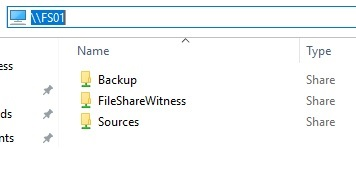
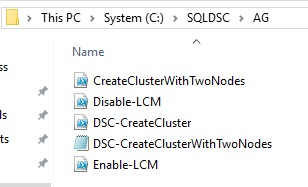
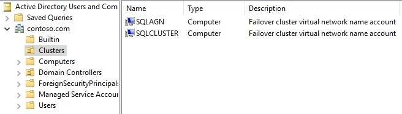
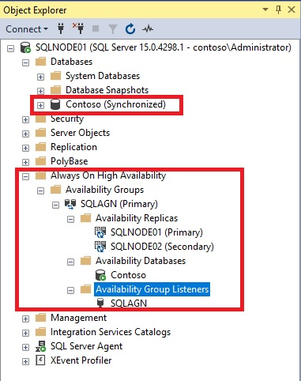
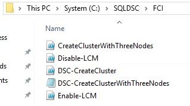
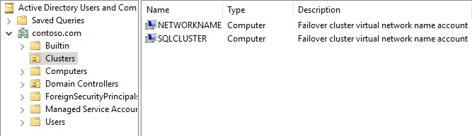
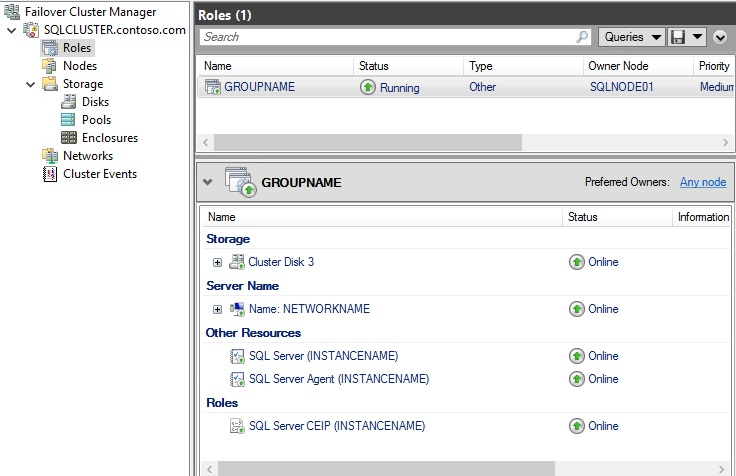
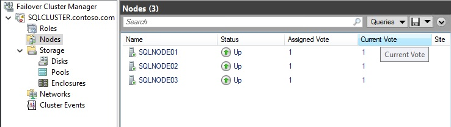
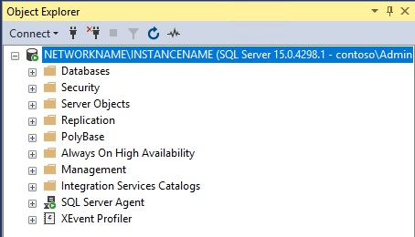

# AutomatedLab, Desired State Configuration (DSC) & SQL Server

[AutomatedLab](https://automatedlab.org) ([GitHub](https://github.com/AutomatedLab/AutomatedLab)) is a project that allows to set up lab and test environments on **Hyper-V** or **[Azure](https://portal.azure.com/)** with multiple products.

Table of content:

- [AutomatedLab, Desired State Configuration (DSC) \& SQL Server](#automatedlab-desired-state-configuration-dsc--sql-server)
  - [Context](#context)
  - [Environment Setup](#environment-setup)
  - [Desired State Configuration : SQL Server](#desired-state-configuration--sql-server)
    - [AG](#ag)
      - [Remarks](#remarks)
    - [FCI](#fci)
      - [Remarks](#remarks-1)
    - [Default Instance](#default-instance)

## Context

This repository contains a set of scripts to deploy an [AutomatedLab](https://automatedlab.org) lab environment for setting up SQL Servers (AG and FCI) with Desired State Configuration (DSC) (The [SqlServerDsc](https://github.com/dsccommunity/SqlServerDsc) PowerShell module is mainly used)

## Environment Setup

Run the [AutomatedLab - DSC & SQL.ps1](AutomatedLab%20-%20DSC%20&%20SQL.ps1) script (PowerShell 5.1 needed) wait for completion (~90-120 minutes - depending of your hardware).
After completion you'll have:

- a Domain Controller for the contoso.com domain: DC01.
- a FileServer for hosting some shares for the required dependencies (Powershell modules, setup binaries ...), the required backups id needed : FS01.

- 3 Nodes for deploying SQL Servers: SQLNODE01, SQLNODE02, SQLNODE03 (SQL Management Studio is already installed for future SQL Server administration purpose).

All Windows Servers are running 'Windows Server 2019 Datacenter (Desktop Experience)'. The SQL Server SKU is 'SQL Server 2019 Enterprise'. Credentials will be displayed at the end of the deployment process.

> [!NOTE]
> You can also use the or [AutomatedLab - DSC & SQL - Pull Scenario with SQL Server Reporting.ps1](<AutomatedLab - DSC & SQL - Pull Scenario with SQL Server Reporting.ps1>) script which adds a pull server (IIS Mode - Server name: PULL) and a SQL Server (Server name: SQL) for Reporting as mentionned [here](https://techcommunity.microsoft.com/t5/core-infrastructure-and-security/configuring-a-powershell-dsc-web-pull-server-to-use-sql-database/ba-p/259626).  

## Desired State Configuration : SQL Server

### AG

This scenario will deploy a SQL Server Availability Group (AG) with 2 replicas (SQLNODE01, SQLNODE02). First of all connect to SQLNODE01 and go to the 'C:\SQLDSC\AG' folder.

Edit the [CreateClusterWithTwoNodes.ps1](SQLServer2019/AG/Push/CreateClusterWithTwoNodes.ps1) script (via PowerShell ISE) and run it. After some minutes (~10 minutes) and some reboots you'll have a SQL Server AG with 2 replicas (SQLNODE01, SQLNODE02)

#### Remarks

- The [CreateClusterWithTwoNodes.ps1](SQLServer2019/AG/Push/CreateClusterWithTwoNodes.ps1) script is just the start script.
- The [DSC-CreateCluster.ps1](SQLServer2019/AG/Push/DSC-CreateCluster.ps1) is the main script (where the magic happens - take a look into it) that will be called by the [CreateClusterWithTwoNodes.ps1](SQLServer2019/AG/Push/CreateClusterWithTwoNodes.ps1) script.
- The [DSC-CreateClusterWithTwoNodes.psd1)](SQLServer2019/AG/Push/DSC-CreateClusterWithTwoNodes.psd1) file is the configuration data file.
- After the deployment you'll have :
  
  - a 'Clusters' OU in the contoso.com domain with 2 dedicated computer account
  
  - an Availability Group named 'SQLAGN' with 2 replicas (SQLNODE01, SQLNODE02) and a synchronized database named 'Contoso'
  - 
  
### FCI

This scenario will deploy a SQL Server Failover Cluster with 3 nodes (SQLNODE01, SQLNODE02 and SQLNODE03). First of all connect to SQLNODE01 and go to the 'C:\SQLDSC\FCI' folder.

Edit the [CreateClusterWithThreeNodes.ps1](SQLServer2019/FCI/Push/CreateClusterWithThreeNodes.ps1) script (via PowerShell ISE) and run it. After some minutes (~30 minutes) and some reboots you'll have a SQL Server Failover Cluster with 3 nodes (SQLNODE01, SQLNODE02 and SQLNODE03)

#### Remarks

- The [CreateClusterWithThreeNodes.ps1](SQLServer2019/FCI/Push/CreateClusterWithThreeNodes.ps1) script is just the start script.
- The [DSC-CreateCluster.ps1](SQLServer2019/FCI/Push/DSC-CreateCluster.ps1) is the main script (where the magic happens - take a look into it) that will be called by the [CreateClusterWithThreeNodes.ps1](SQLServer2019/FCI/Push/CreateClusterWithThreeNodes.ps1) script.
- The [DSC-CreateClusterWithThreeNodes.psd1](SQLServer2019/FCI/Push/DSC-CreateClusterWithThreeNodes.psd1) file is the configuration data file.
- After the deployment you'll have :
  
  - a 'Clusters' OU in the contoso.com domain with 2 dedicated computer account
  
  - a Failover Cluster Instance with 3 nodes (SQLNODE01, SQLNODE02 and SQLNODE03)
 
 
 

### Default Instance

This scenario will deploy a SQL Server Default Instance in one of the following modes:

- Pull mode: The DSC configuration is applied directly on the SQLNode01 server. The server name is specified in the [DSC-CreateDefaultInstance.psd1](SQLServer2019/DefaultInstance/Pull/DSC-CreateDefaultInstance.psd1) file. Change it at your convenience. for this scenario you must use the [AutomatedLab - DSC & SQL - Pull Scenario with SQL Server Reporting.ps1](<AutomatedLab - DSC & SQL - Pull Scenario with SQL Server Reporting.ps1>) script for the deployment.
- Push Mode: The DSC configuration is applied directly on the server where the script is run.
