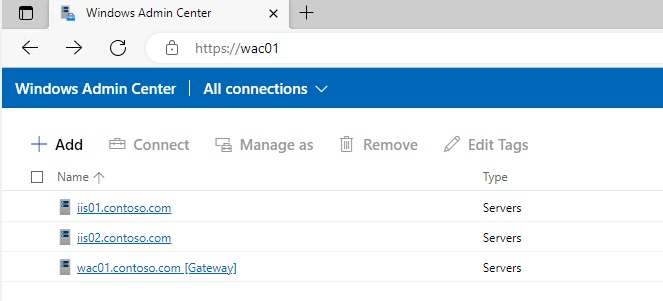

# Windows PowerShell : IIS & Windows Admin Center
This is simple AutomatedLab scripts demonstrating how to use Windows Admin Center to manage IIS.

Table of content:
- [Windows PowerShell : IIS \& Windows Admin Center](#windows-powershell--iis--windows-admin-center)
  - [Context](#context)
  - [AutomatedLab version](#automatedlab-version)
    - [Prerequisites](#prerequisites)

## Context
[Windows Admin Center](https://aka.ms/WACDownload) is a locally deployed, browser-based app for managing Windows servers, clusters, hyper-converged infrastructure, as well as Windows 10 PCs. It is a free product and is ready to use in production.

## AutomatedLab version

[AutomatedLab](https://automatedlab.org) ([GitHub](https://github.com/AutomatedLab/AutomatedLab)) is a project that allows to set up lab and test environments on **Hyper-V** or **[Azure](https://portal.azure.com/)** with multiple products.
### Prerequisites 

Run the [AutomatedLab - IIS - Windows Admin Center - WS2022.ps1](AutomatedLab%20-%20IIS%20-%20Windows%20Admin%20Center%20-%20WS2022.ps1) script (PowerShell 5.1 needed) wait for completion (~30 minutes).
After completion you'll have:
* A Domain Controller for the contoso.com domain: DC01.
* Two IIS servers (IIS01 and IIS02) for testing IIS management via [Windows Admin Center](https://aka.ms/WACDownload).
* A [Windows Admin Center](https://aka.ms/WACDownload) gateway/management server to manage the others servers (and particularly the IIS servers). The connections to IIS01 and IIS02 are already registered as you can see on the screenshot below. All the Microsoft [Windows Admin Center](https://aka.ms/WACDownload) extensions (for testing purposes) are installed and updated to the latest versions.

All Windows Servers are running 'Windows Server 2022 Datacenter (Desktop Experience)'. Credentials will be displayed at the end of the deployment process. Just connect via RDP to the WAC01 and open an Edge browser. The https://wac01 will automatically be loaded (Thanks to GPO settings). 

