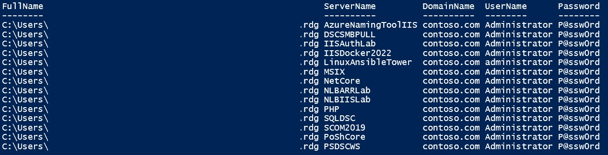
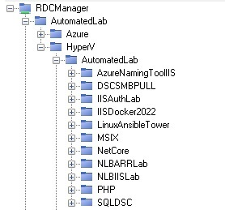

# Remote Desktop Connection Manager

You'll find here some scripts related to Remote Desktop Connection Manager.
* [Get-RDCManCredential.ps1](Get-RDCManCredential.ps1) will give you clear text credentials from a RDCMan file. Can be useful when, like me, you generate a lot of test VMs (HyperVM or Azure) with randomly generated passwords and you forget them (but you have stored them in a RDCMan file)

* [Update-AutomatedLabRDCMan.ps1](Update-AutomatedLabRDCMan.ps1) will create or update a specified RDCMan file with all VMs in the automatedlab labs. This script is useful when you have a lot of labs with a lot of VMs and you want to keep a RDCMan file up to date with the labs.

