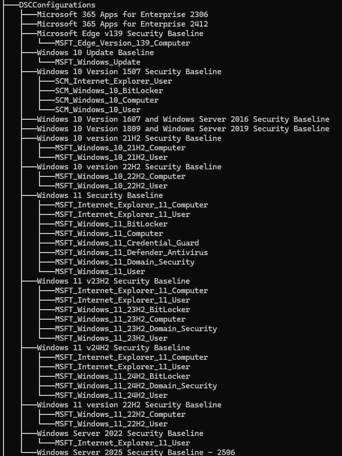
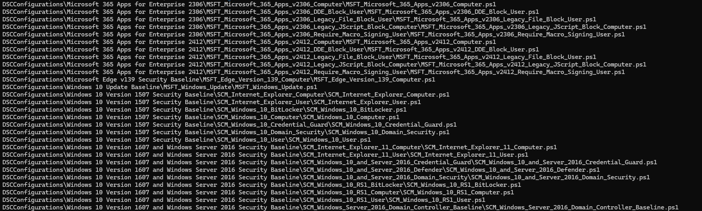
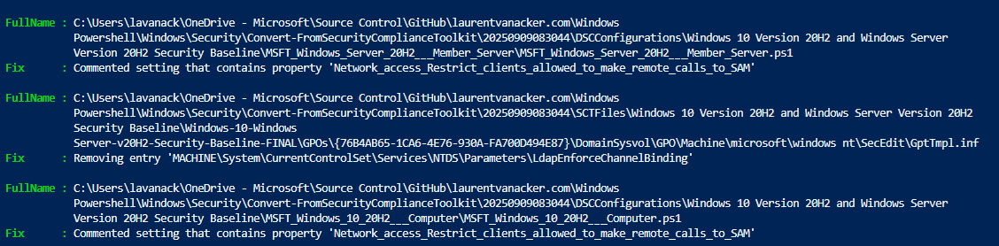

# Convert Microsoft Security Compliance Baselines to Desired State Configuration (DSC) scripts

[](https://github.com/PowerShell/PowerShell)
[](https://learn.microsoft.com/en-us/azure/governance/machine-configuration/)
[](LICENSE)

---

## 📋 Table of Contents

- [Overview](#-overview)
- [Background](#-background)
- [Features](#-features)
- [Script Details](#-script-details)
- [Output Structure](#-output-structure)
- [Known Issues & Automatic Fixes](#-known-issues--automatic-fixes)
- [Sample Output](#-sample-output)
- [Next Steps](#-next-steps)
- [Resources](#-resources)

---

## 🎯 Overview

This PowerShell script automates the conversion of [**Microsoft Security Compliance Toolkit** baselines](https://www.microsoft.com/en-us/download/details.aspx?id=55319) into **Desired State Configuration (DSC)** scripts. It downloads, processes, and transforms Group Policy Objects (GPOs) into Desired State Configuration (DSC) scripts that can be used with [Azure Machine Configuration](https://learn.microsoft.com/en-us/azure/governance/machine-configuration/) for security compliance automation.

## 📚 Background

This project was inspired by a customer engagement focused on [**Azure Machine Configuration**](https://learn.microsoft.com/en-us/azure/governance/machine-configuration/) for security hardening. The development was based on the excellent article: [Convert MS Security Baselines to Azure ARC Guest Configuration Packages](https://doitpshway.com/convert-ms-security-baselines-to-azure-arc-guest-configuration-packages).

The script serves as an enhanced version that addresses common conversion issues and provides automated fixes for known problems.

## ✨ Features

- 🔄 **Automated Download**: Fetches all tools from Microsoft Security Compliance Toolkit 1.0
- 🛠️ **Batch Conversion**: Converts multiple GPOs to DSC configurations simultaneously
- 🔧 **Auto-Fix**: Automatically resolves common conversion issues using regex patterns
- 📁 **Organized Output**: Creates timestamped, structured output directories
- 📊 **Progress Reporting**: Provides detailed progress and modification reports
- 💻 **Platform**: Works with PowerShell 7+

## 🔧 Script Details

### [`Convert-FromSecurityComplianceToolkit.ps1`](Convert-FromSecurityComplianceToolkit.ps1)

**Purpose**: Downloads and converts Microsoft Security Compliance Toolkit baselines to DSC configurations.

**Key Functionality**:

- Downloads from [Microsoft Security Compliance Toolkit 1.0](https://www.microsoft.com/en-us/download/details.aspx?id=55319)
- Processes each GPO into a dedicated DSC configuration script
- Creates timestamped output folder (`yyyyMMddHHmmss` format)
- Applies automatic fixes for known conversion issues

**Usage**:

```powershell
.\Convert-FromSecurityComplianceToolkit.ps1 [-Output <String>] [-Verbose]
```

## 📂 Output Structure

The script generates a well-organized directory structure:

```
📁 Output Folder (Timestamped: yyyyMMddHHmmss)
├── 📁 DSCConfigurations/
│   ├── 📁 Security Topic #1/
│   │   ├── 📁 GPO Name #1/
│   │   │   ├── 📄 GPO Name #1.ps1
│   │   │   └── 📄 localhost.mof
│   ├── 📁 Security Topic #2/
│   │   ├── 📁 GPO Name #2/
│   │   │   ├── 📄 GPO Name #2.ps1
│   │   │   └── 📄 localhost.mof
│   └── ...
└── 📁 SCTFiles/
```

### Visual Examples

#### Directory Tree View



#### DSC Configurations Structure



## ⚠️ Known Issues & Automatic Fixes

### Common Conversion Problems

As documented in the [BaselineManagement repository](https://github.com/microsoft/BaselineManagement?tab=readme-ov-file#known-gaps-in-capability), some `localhost.mof` files may fail to compile due to DSC limitations.

### 🔧 Automated Solutions

This script includes **intelligent regex-based fixes** that automatically:

- ✅ Remove problematic configuration sections
- ✅ Comment out unsupported DSC elements
- ✅ Adjust syntax for compatibility
- ✅ Generate detailed modification reports

#### Auto-Fix Report Example



> **Note**: All automatic modifications are logged and reported for transparency and troubleshooting.

## 📦 Sample Output

A complete sample run is available as a ZIP file: [`20250913180101.zip`](20250913180101.zip)

This sample includes:

- ✅ Successfully converted DSC configurations
- ✅ Generated MOF files
- ✅ Conversion logs and reports
- ✅ Applied auto-fixes documentation

## 🚀 Next Steps

### Azure Machine Configuration Integration

To advance your Azure Machine Configuration implementation:

1. **Transform DSC to Azure Machine Configuration**: Convert generated scripts to Azure-compatible packages
2. **Deploy Configurations**: Use Azure Policy and Machine Configuration for compliance enforcement
3. **Monitor Compliance**: Set up dashboards and reporting for security posture

### Additional Resources

🔗 **Explore the complete Azure Machine Configuration toolkit**:
- [Azure Machine Configuration Examples](https://github.com/lavanack/laurentvanacker.com/tree/master/Azure/Desired%20State%20Configuration/Azure%20Machine%20Configuration)
- [Microsoft Security Compliance Toolkit baselines with Azure Machine Configuration](https://github.com/lavanack/laurentvanacker.com/tree/master/Azure/Desired%20State%20Configuration/Azure%20Machine%20Configuration/Windows/Microsoft%20Security%20Compliance%20Toolkit)

### Compatibility Notes

> 💡 **Windows PowerShell DSC**: The generated configurations are also compatible with traditional Desired State Configuration in Windows PowerShell 4+.

## 📖 Resources

| Resource                          | Description                               | Link                                                                                                           |
| --------------------------------- | ----------------------------------------- | -------------------------------------------------------------------------------------------------------------- |
| 🔗 **Azure Machine Configuration** | Official Microsoft documentation          | [Learn More](https://learn.microsoft.com/en-us/azure/governance/machine-configuration/)                        |
| 🔗 **Security Compliance Toolkit** | Microsoft download page                   | [Download](https://www.microsoft.com/en-us/download/details.aspx?id=55319)                                     |
| 🔗 **BaselineManagement Module**   | PowerShell module for baseline conversion | [GitHub](https://github.com/microsoft/BaselineManagement)                                                      |
| 🔗 **Original Article**            | Inspiration for this project              | [Read Article](https://doitpshway.com/convert-ms-security-baselines-to-azure-arc-guest-configuration-packages) |

---

<div align="center">

**⭐ If this project helps you, please consider giving it a star! ⭐**

*Developed for Azure Machine Configuration automation and security compliance*

</div>
